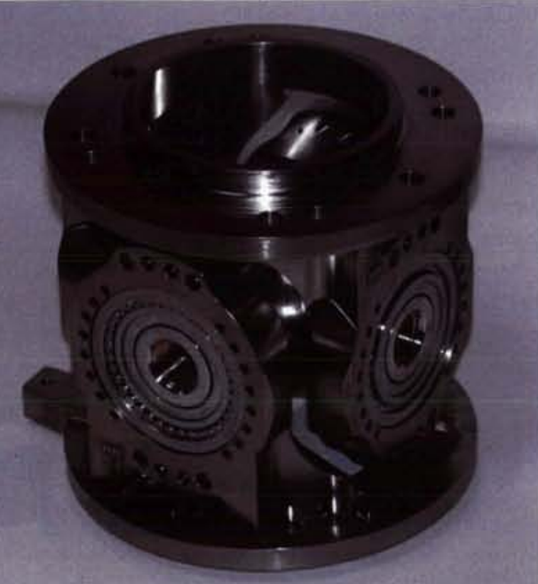
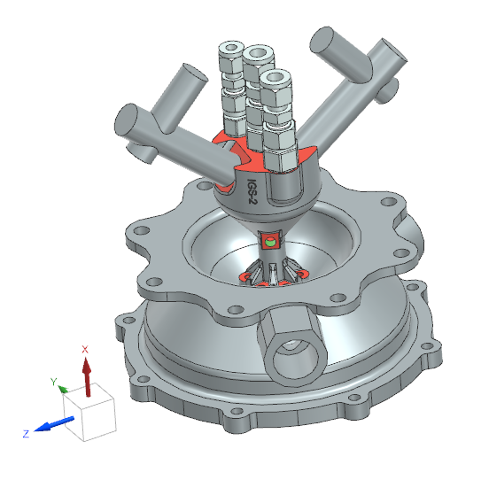

<!--An extension to these requierements are given in a Excel named "Huracan-TVC-Preliminary-Spec.xlsx" created by Pierre Vinet -->

\pagenumbering{roman}
\setcounter{page}{1}
\tableofcontents
\clearpage
\pagenumbering{arabic}

# 1. Introduction
## 1.1. Scope
This document presents the Gimbal Mount Assembly (GMA) Trade-Off Report. The objective of this file is to support the concept design decision among alternative solutions taking into account technical and programmatic constraints. 

##  1.2. Reference
[RD1] A.Lukanowski - Gimbal Mount Assembly - Requirement Consolidation / Version 0 - Luebeck 2026

[RD2] A.Lukanowski - Gimbal Mount Assembly - Preliminary Verification Control Document / Version 0 - Luebeck 2026

[RD3] ECSS-E-ST-10C Rev.1 - System engineering general requirements

[RD4] T.L. Saaty - Decision Making for Leaders: The Analytic Hierarchy Process for Decision in a Complex World - Pittsburgh 1990

[RD5] D.Huzel, D.Huang - Modern Engineering For Design Of Liquid-Propellant Rocket Engines - Washington 1992

[RD6] A.Lukanowski - 20260310_Luka_GMA_Tradeoff_AHP / Excel file - Luebeck 2026

[RD7] P.Vinet - NYX Moon - Huracan Development Logic - TEC-FRA-DOC-2024-01004 - Bordeaux 2024

[RD8] A.Lukanowski - 20260309_Luka_GMA_Tradeoff_Decision Matrix.xlsx / Excel file - Luebeck 2026

[RD9] P. Muraro - System Requirements Document - TEC-ITA-DOC-2025-01017 / Version 0

\clearpage

# 2. Trade-Off 

## 2.1. Philosophy and criteria

The trade-off philosophy for this specific use case is to have a design that is *safe, simple and achievable* within the time frame. This philosophy is given by the low Technology Readiness Level (TRL) of the GMA in the current project state (here: TRL 1/2) and programmatic constraints (e.g. delivery of a functional model before DM2). The objective is to deliver a functional model on schedule by keeping it as simple as possible and only as complex as necessary considering technical feasibility constraints.

**Program criteria**  
  Programmatic aspects are associated to "The How and When"-question, which shall address the lifecycle, constraints and hence the success of the project. For this project, the focus of this criteria is mainly the schedule (timeline, lead time), execution (supply chain / manufacturing) and testability. 

**Functional criteria**  
  The functional criteria refer to the question "What?", which is linked to the control authority needs. Those key performance requirements [RD1] are the gimbal angle, angular speed and precision. In addition, the mass requirement is directly associated to the overall mass budget, while the volume envelopes the geometrical constraint to fulfill the key requirements (e.g. clearance vs. gimbal angle) and the integration. 

**Feasibility criteria**  
  The "If"-question is covered by feasability aspects, which refer to technical risks reduction, related to its TRL, the design complexity (part count, tolerance sensitivity, inspectability) and its load capability (thermal and mechanical).
  
## 2.2. Methodology

The trade-off is performed by using the methodology of the Analytic Hierarchy Process (AHP) [RD4], combined with an subsequent decision matrix. The methodology of AHP helps to evaluate criteria by breaking problems into a hierarchy of simpler elements. It covers the following steps:

1. Structuring the problem into a hierarchy with objectives, criteria and sub-criteria
2. Pairwise comparison and weighting of the criteria.
3. Ranking alternatives based on the overall scores to aid in selecting the best option

For this trade study, the weights derived from the AHP are taken as input for the decision matrix. In this decision matrix, several design options will be weighted against each other based on the criteria coming from the AHP. The outcome shall be a suggestion for a final concept design. 

## 2.3. Analytic Hierarchy Process (AHP)

For this study, an AHP-template was utilized that is annexed in the delivery package of this document [RD6]. The fundamental scale values of the AHP are shown in the figure below. 

![AHP scale [RD6]](figures/20260311_Luka_Trade-Off_AHP_Scale.png){width=30%}

Considering the trade-off philosophy *"safe, simple, achievable"*, the scaling values are assigned to 8 criteria in the AHP as shown in the subsequent figure.

![Pairwise Comparison Matrix [RD6]](figures/20260311_Luka_Trade-Off_AHP_Pairwise Comparison Matrix.png)

The computed plausibility of the assignments is given by a consistency of 4 % (<10 % for successful consistency required). The resulting AHP weights and related rankings of the criteria listed below.

|**Criteria**|**AHP**|**Ranking**|
|---|---|---|
|Timeline & Execution|15.1 %|3|
|Testability|28.7 %|1|
|**PROGRAMMATIC total**|**43.8 %**|**1**|
||||
|Angle, speed, precision|7.8 %|6|
|Mass|3.4 %|8|---|
|Geometry / Volume|4.1 %|7|
|**FUNCTIONALITY total**|**15.2 %**|**3**|
||||
|TRL|20.6 %|2||3|
|Complexity|11.3 %|4|
|Load capability|9.1 %|5|
|**FEASIBILITY total**|**41 %**|**2**|
: Criteria, AHP and Ranking

With a total weight of 43.8 %, programmatic criteria represent the most influential category. In particular, the need for testability accounts for 28.7 % of the overall decision model and therefore constitutes the single most dominant criterion.

The second most influential factor is the TRL, which acts as the primary feasibility driver with a weight of 20.6 % (Rank 2). In contrast, functional performance represents a secondary optimization layer. Although its overall contribution (15.2 %) is comparatively small, it cannot be fully neglected in the decision process.

The weighting indicates that the development strategy clearly prioritizes risk reduction through verification and validation approaches. Consequently, complex or low-TRL but innovative concepts will only remain competitive if they provide significant advantages in other areas and are supported by a strong analytical justification.

The results further suggest that heavier solutions with a larger geometrical envelope or non-optimal performance margins may still be selected, provided that they are easily testable, exhibit an acceptable maturity level (minimum TRL 4), and can be delivered within the required development timeline.

Regarding complexity (11.3 %, Rank 4), the results indicate that more complex designs are acceptable as long as they maintain sufficient maturity and remain compatible with feasible verification approaches.

Overall, the weighting generated by the AHP analysis aligns well with the philosophy intentions mentioned above, emphasizing programmatic reliability and technological maturity over purely performance-driven optimization.

## 2.4. Design options
Several methods exist for Thrust Vector Control Systems (TVC) of vehicles. Some examples are auxiliary jets, secondary injection or a gimbaled engine [RD5]. Common approaches include auxiliary jet systems, secondary injection, or a gimbaled engine configuration [RD5]. In this study, the focus is placed on the gimbaled engine solution, as it represents the most widely used and mature concept for rocket propulsion systems.

A gimbaled engine system consists of a Gimbal Mount Assembly (GMA), which provides rotational degrees of freedom about two perpendicular axes (pitch and yaw), and two actuators, which generate the required engine deflection. Different GMA architectures exist, primarily distinguished by their geometric configuration. The three main concepts considered in this study are briefly described below.

**Ring-type**  
A classical Ring-type GMA design is shown in the figure below. It consists of a lower support structure that is typically attached on the top of the Injection Head (IH). A gimbal ring interfaces this lower structure with an upper structure, that is connected with the thrust frame of the vehicle. The rotational degree of freedom is realized by four bearings, which are clocked in an 90° arrangement. This design is widely used in engines, where clearance is needed through the vertical center of the engine (e.g. propellant-duct).  

![Ring-type GMA [RD5]](figures/20260311_Luka_Trade-Off_Ring_type gimbal.png){width=37%}

**Cross-type**  
The cross-type GMA is closely related to the ring-type design but offers improvements in structural stiffness and compactness. Unlike the ring-type configuration, it does not provide a central opening for routing components such as propellant ducts.

In this design, the inner races of the bearings are supported by a monolithic cross-shaped bolt structure, with the bearing axes arranged at 90°. The outer races are mounted within upper and lower retainers or housings, which function similarly to the upper and lower support structures of the ring-type configuration.

An example of this architecture is the GMA developed for the VINCI upper-stage engine, as shown in figure. 

{width=32%}

**Spherical-type**  
The spherical-type GMA provides high load capability combined with a relatively compact structural design. It consists of upper and lower flanges, which connect the engine to the vehicle structure.

The gimbal mechanism itself is implemented as a ball-and-socket joint, formed by convex and concave spherical surfaces. These surfaces are typically interfaced by a Teflon–fiber-glass composite layer, which provides low friction and enables a maintenance-free operation.

This concept has been used in high-performance engines such as the RS-25 and Vulcain 2 core stage engines.

![Spherical-type GMA [RD5]](figures/20260311_Luka_Trade-Off_Spherical-type gimbal 2.png){width=75%}

## 2.5. Decision matrix
The ring-, cross-, and spherical-type gimbal mount concepts are evaluated using a weighted decision matrix. The weighting factors applied in the comparison are derived from the previously conducted AHP analysis, which defines the relative importance of the considered evaluation criteria.

Each concept is assessed using a qualitative scoring scale ranging from 1 to 5, where:

- 1 represents poor performance
- 3 represents moderate performance
- 5 represents excellent performance

The assigned scores are based on engineering judgement, available literature, and expected mechanical and thermal characteristics of the respective gimbal architectures.

For the final evaluation, the individual scores are multiplied by the corresponding AHP-derived importance factors, and the resulting values are summed across all criteria to obtain the weighted score for each concept. The decision matrix shown below summarizes the evaluation results, while the subsequent table presents both the unweighted totals and the weighted scores derived from the applied methodology.

![Decision matrix [RD8]](figures/20260313_Luka_Trade-Off_Decision Matrix.png){width=65%}

|**Gimbal type**|**Unweighted score**|**Weighted score @AHP**|
|---|---|---|
|Ring-type|26|3.5|
|Cross-type|27|3.2|
|Spherical-type|27|2.7|
: Gimbal types scored unweighted / weighted

Although the cross-type and spherical-type mounts achieve slightly higher raw scores, the ring-type gimbal mount obtains the highest weighted score due to strong performance in the most critical criteria, particularly testability and TRL

## 2.6. Summary and conclusion

A trade-off analysis was performed to compare three candidate gimbal architectures: ring-type, cross-type, and spherical-type mechanisms. The evaluation considered programmatic, functional, and feasibility-related criteria. The relative importance of each criterion was derived from a prior AHP, and each concept was scored on a qualitative scale from 1 (poor) to 5 (excellent). The final ranking was obtained by applying the AHP-derived importance weights to the individual scores.

Based on the applied methodology and weighting scheme, the ring-type gimbal configuration achieves the highest weighted score and therefore appears to provide the most favorable overall balance among the evaluated criteria. In particular, this concept aligns well with the current geometric constraints of the surrounding engine architecture, where the available peripheral space favor a ring-type arrangement. This is mainly driven by the position of the Ignition System (IGS) and its connectors. 

{width=40%}

However, it should be noted that these geometric constraints are dependent on the present system layout and may evolve as the overall design matures. Changes in the surrounding structural configuration and available integration volume could reduce or eliminate this advantage.

Consequently, while the ring-type configuration presently emerges as the most suitable option according to the weighted trade-off analysis, the cross-type concept remains a viable alternative, especially if future design iterations modify the geometric boundary conditions. The results of this trade-off should therefore be interpreted as a recommendation under the current design assumptions, rather than as a final or irreversible selection.

# 3. Conclusion and way forward

This trade study is executed under current restriction of the project, which dictate the weights and hence the priority of the GMA design. Under these circumstances, the favored design option of the ring-type GMA is valid for the constraints mainly associated to the *Oneiros* project [RD9]. For the mission *Hilal*, the requirements are expected to be different in terms of technical and programmatic aspects. A seperated trade-off report is recommended in this case as the design choice may be in favor of an alternative option.

\clearpage

# 4. Acronym List  
The acronyms used in this document are listed below.  

| **Acronym**  | **Definition**   |
|---|---|
|AHP|Analytic Hierarchy Process|
|DM2|Development Model 2|
|GMA|Gimbal Mount Assembly|
|IGS|Ignition System|
|IH|Injection Head flange|
|TRL|Technology Readiness Level|
|TVC|Thrust Vector Control|
: Acronyms