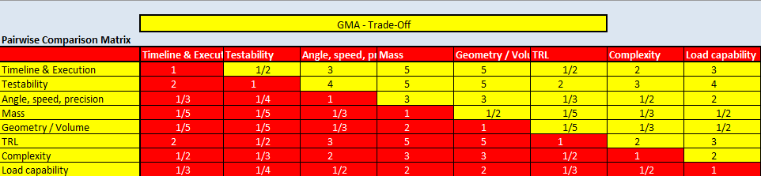
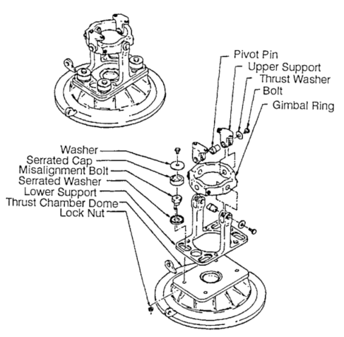
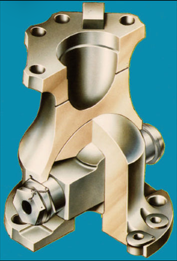

<!--An extension to these requierements are given in a Excel named "Huracan-TVC-Preliminary-Spec.xlsx" created by Pierre Vinet -->

\pagenumbering{roman}
\setcounter{page}{1}
\tableofcontents
\clearpage
\pagenumbering{arabic}

# 1. Introduction
## 1.1. Scope
This document presents the Gimbal Mount Assembly (GMA) Trade-Off Report. The objective of this file is to assist with alternative design solutions taking into account technical, programmatic constraints. 

##  1.2. Reference
[RD1] Gimbal Mount Assembly - Requirement Consolidation - Version 0

[RD2] Gimbal Mount Assembly - Preliminary Verification Control Document - Version 0

[RD3] ECSS-E-ST-10C Rev.1 - System engineering general requirements

[RD4] T.L. Saaty - Decision Making for Leaders: The Analytic Hierarchy Process for Decision in a Complex World - Pittsburgh 1990

[RD5] D. Huzel, D. Huang - Modern Engineering For Design Of Liquid-Propellant Rocket Engines - Washington 1992

\clearpage

# 2. Trade-Off 

## 2.1. Philosophy and criteria

The trade-off philosophy for this specific use case is to have a design that is safe, simple and achievable within the time frame. The criteria chosen for the trade study cover programmatic (how and when?), functional (what?), and feasibility (if?) aspects. The objective here is not to provide an elaborated design, that ignores deadlines, procurement -, manufacturing challanges etc.

**Program criteria**  
  Programmatic aspects are associated to "The How and When"-question, which shall address the lifecycle, constraints and hence the success of the project. For this project, the focus of this criteria is mainly the schedule (timeline, lead time), execution (Supply Chain / manufacturing) and testability. 

**Functional criteria**  
  The functional criteria refer to the question "What?", which is linked to the control authority needs. Those key performance requirements [RD1] are the gimbal angle, angular speed and precision. The mass requirement is directly associated to the overall mass budget, while the volume envelops the geometrical constraint to fullfill the key requirements (e.g. clearance vs. gimbal angle) and the integration. 

**Feasibility criteria**  
  Feasability aspects refer to technical risks reduction, related to its Technology Readyness Level (TRL), the design complexity (part count, tolerance sensitivity etc.) and its load capability (thermal and mechanical).

  
## 2.2. Methodology

The trade-off is performed by using the methodology of the Analytic Hierarchy Process (AHP) [RD4], combined with an subsequent decision matrix. The methodology of AHP
helps to evaluate multiple criteria by systematically breaking problems into a hierarchy of simpler elements. It covers
the following steps:

1. Structuring the problem into a hierarchy with objectives, criteria and sub-criteria
2. Pairwise comparison and weighting of the criteria.
3. Ranking alternatives based on the overall scores to aid in selecting the best option

For this trade study, the weights derived from the AHP will be taken as an input for a decision matrix. In this decision matrix, several design options will be weighted against each other based on the criteria coming from the AHP. The outcome shall be a suggestion for a the final concept design. 

### 2.2.1. Analytic Hierarchy Process (AHP)

The fundamental scale values of the AHP utilized for the pairwise comparison are shown below.

|**Importance**|**Scale value**|
|---|---|
|Extremely less important|1/9|
||1/8|
|Very strongly less important|1/7|
||1/6|
|Strongly less important|1/5|
||1/4|
|Moderately less important|1/3|
||1/2|
|Equal importance|1|
||2|
|Moderately more important|3|
||4|
|Strongly more important|5|
||6|
|Very strongly more important|7|
||8|
|Extremely more important|9|

Considering the trade-off philosophy *"safe, simple, achievable"*, the scaling values are assigned to 8 criteria in the AHP as shown in the the figure below.

With an consistency check of 3% (sucessfull consistency <10%), the final AHP and ranking of the criteria is as follows:

|**Criteria**|**AHP**|**Ranking**|
|---|---|
|PROGRAMMATIC|---|
|Timeline & Excution|17.6 %|3|
|Testability|28.1 %|1|
|FUNCTIONAL|---|---|
|Angle, speed, precision|8.5 %|5|
|Mass|3.5 %|8|
|Geometry / Volume|4.2 %|7|
|FEASIBILITY|---|
|TRL|20.7 %|2|
|Complexity|11.1 %|4|
|Load capability|6.3 %|6|

The final ranking of the main criteria are summarized below. As a result it is obvious that the project is driven by risk and schedule related aspects, followed by engineering feasibility and then functional criteria.

|**Criteria**|**AHP**|**Ranking**|
|---|---|
|FEASIBILITY|38.1 %|
|PROGRAMMATIC|45.7 %|
|FUNCTIONAL|16.2 %|

### 2.2.2. Design options
Typical designs for gimbal mechanisms [RD5] are

|**Ring-type **|**Cross-type**|**Spherical-type**|
|---|---|---|
||||

### 2.2.3. Decision matrix

### 2.2.4. Conclusion and final concept
Three different concepts exist in rocketry for gimbal mechanisms:
- Ring type
- Spherical type
- Cross type
- Other

\clearpage

# 3. Acronym List  
The acronyms used in this document are listed below.  

| **Acronym**  | **Definition**   |
|---|---|
|AHP|Analytic Hierarchy Process|
|IH|Injection Head flange|
|GMA|Gimbal Mount Assembly|

