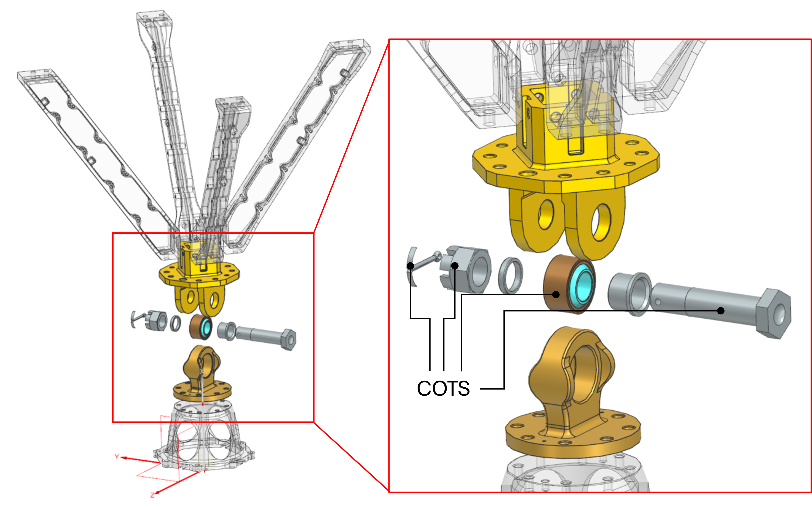

<!--An extension to these requierements are given in a Excel named "Huracan-TVC-Preliminary-Spec.xlsx" created by Pierre Vinet -->

\pagenumbering{roman}
\setcounter{page}{1}
\tableofcontents
\clearpage
\pagenumbering{arabic}

# Introduction
## Scope
The definition file serves as the identity card of the Gimbal Mount Assembly (GMA), detailing its intended capabilities and interactions with other systems. The document aims to provide a thorough understanding of the following key aspects:

• Overview of the components that constitute the GMA and their main purposes  
• Description of the mechanical characteristics
• Identification of the operating characteristics and the main performance metrics   
•  Preliminary cost estimation 
•  Design recommendations for adjacent parts

##  Reference

[RD1] Nyx Moon - Huracan Development Logic / TEC-FRA-DOC-2024-01004 / Issue 02 

[RD2] Gimbal Mount Assembly - Requirement Consolidation / Version 0 

[RD3] Gimbal Mount Assembly - Interface Control Document / Version 0 

[RD4] Gimbal Mount Assembly - Justification File / Version 0 

[RD5] BEARINGS, CONTROL SYSTEM COMPONENTS, AND ASSOCIATED
HARDWARE USED IN THE DESIGN AND CONSTRUCTION OF
AEROSPACE MECHANICAL SYSTEMS AND SUBSYSTEMS / MIL-STD-1599 

\clearpage

# GMA Overview
## Engine system context  
The development logic of the Huracan engine system, as presented during the Preliminary Design Review (PDR), features a rigid thrust structure that interfaces the main engine with the vehicle [RD1]. Based on this logic, GNC maneuvers were originally intended to be performed by a Reaction Control System (RCS).

For the on-Earth demonstrator *Oneiros*, which shall be driven by the Huracan engine, pitch and yaw control is planned to be realized by a Thrust Vector Control (TVC) system. The TVC system steers the vehicle by physically pivoting, or gimballing, the main engine in order to vector the thrust. Therefore, the main mechanical components of the TVC system are the Gimbal Mount Assembly (GMA) and two actuators. 

This Definition File focuses exclusively on the development of the Gimbal Mount Assembly (GMA).

In the figure below, the GMA and its position within the engine layout are shown. The GMA is attached to a Thrust Dome, which interfaces with the Injection Head (IH). This interface provides clearance and accessibility for the centrally located Ignition System (IGS) and its periphery. The upper end of the GMA is connected to the Thrust Frame Beams, which are individually connected to the GMA.

{ width=55% }

## Role of the GMA in the Engine System  
The main role of the GMA is to provide the structural and kinematic connection between the engine’s Thrust Chamber Assembly (TCA) and the vehicle structure, while allowing controlled angular deflection of the engine.

The GMA does not directly generate thrust, specific impulse, or combustion performance. However, it is strongly influenced by engine-level performance and configuration, since these parameters define the loads, deflections, actuator forces, alignment requirements, and environmental conditions that the assembly must withstand.

The GMA shall therefore be considered an interface and primary mechanical load-path component between the engine and the vehicle. It transmits nominal thrust loads of 15 kN in vacuum and 10 kN under atmospheric conditions. In addition to transmitting the nominal loads, the GMA shall provide an operational gimbal capability of ±10° per axis in pitch and yaw. Further requirements shown in the Requirement Consolidation [RD2].

# GMA Design Definition

## Assembly architecture

Breaking down the assembly from the engine system to the GMA and its direct adjacent parts, the figure below shows the GMA connected with the Thrust Dome (bottom) and the Thrust Frame Beams (above). The Thrust Dome and the Thrust Frame Beams are transperantly illustrated as those are not within the scope of this development. Neverthless, design recommendations for these specific parts have been made in a subsequent chapter. 

{width=80%}

The final GMA design features 8 parts in total, 4 COTS and 4 custom made. Military and aerospace standards related machine parts are chosen for COTS parts due to their guaranteed material properties, tight tolerances and controlled manufacturing and inspection procceses. Imperial units will be compromised for this project due cheaper and faster sourcing of those parts. In the explosion view below, the COTS parts are shown, while the rest is custom made.  

{width=80%}

## Part breakdown, material and mass

The image and subsequent tables below illustrates the components and its designated material in a isometric and cross-section view.

 { width=70% }

| **Number** | **CAD-ID** | **Designation** | **Material** | **Mass** |
| :---: | :---: | :--- | :---: | :---: |
| 1 | 126749/01 | GMA Clevis Head | 17-4PH - H900 | 0.864 kg |
| 2 | 3489/01 | COTTER PIN MS24665-374 | AISI 302 or 304 | 0.0022 kg |
| 3 | 126711/01 | GMA GMA Bushing | 17-4PH - H900 | 0.0147 kg |
| 4 | 3423/01 | BOLT NAS6710DU29 | CRES A286 | 0.1316 kg |
| 5 | 3437/01 | Nut MS9358-16 | CRES A286 | 0.0386 kg |
| 6 | 126707/01 | GMA GMA Spacer | 17-4PH - H900 | 0.0003 kg |
| 7 | 3489/01 | BEARING MS14103-10 | 330C / 17-4PH - H900 | 0.1089 kg |
| 8 | 124890/01 | GMA Lug Head | 17-4PH - H900 | 0.381 kg |
| **Total mass** |  | |  | **1.544 kg** |

Taking into account the bolts, washers and nuts, an additional CAD-mass of 0.212 kg is to be considered (table below). Thus, the total mass equals approximatly 1.8 kg. The detailed description of the interface connections is stated in the Interface Control Document (ICD) of the GMA [RD3]. 

| **Part**| **CAD-ID** | **Material** | **Mass** |
| ------- | ------- | ------- | ------- |
| FASTENERS ISO4017 M6x16 16x|20881/01| A4-70 | 0.0978 kg|
| FASTENERS ISO4017 M6x25 8x|20883/01| A4-70 | 0.0648 kg|
| NUTS ISO4032-M6 8x|14483/01| A4-70 | 0.0219 kg|
| WASHERS ISO7092-6 32x|11263/01 | 200HV-A4| 0.0256 kg|
| PINS ISO8734-4x10|1603/01 | C1 | 0.0019kg|
| **Total mass** |  |  |**0.212 kg**|

## Tolerances and fits

The choice of geometrical fits between mating diameters is driven by COTS parts utilized in the design for BEARING and BOLT and their fixed dimensions, recommendations by standards for BEARING and GMA Lug Head, functionality and flexibility during MAIT procedures. 

| **Parts** | **Shaft (mm)** | **Hole (mm)** | **Resulting tolerance / clearance (mm)** |
|:---:|:---:|:---:|:---:|
| BEARING & LUG | 30.1498–30.1625 | 30.1570–30.1700 | **−0.0055 to +0.0202** |
| BOLT & BEARING | 15.8369–15.8496 | 15.8623–15.8750 | **+0.0127 to +0.0381** |
| BOLT & CLEVIS | 15.8369–15.8496 | 15.8623–15.8750 | **+0.0127 to +0.0381** |
| BOLT & BUSHING | 15.8369–15.8496 | 15.8623–15.8750 | **+0.0127 to +0.0381** |
| BOLT & SPACER | 15.8369–15.8496 | 15.8623–15.8750 | **+0.0127 to +0.0381** 
| BUSHING & CLEVIS | 19.9800–19.9930 | 20.0000–20.0210 | **+0.0070 to +0.0410** |

**JUSTIFICATION**
**=>LUG-BEARING: Recommendation by [RD5] and supplier recommendations for rod ends**
**=>Bearing-Bolt dimensions given**
**=>BUSHING-CLEVIS chosen to be clearance fit to ensure precise axial positioning of BEARING innter race**
**SPACER/BUSHING-BOLT clearance fit for flexibiltiy in terms of integration**

# Functional characteristics 
An overview of the main function w.r.t. the GMA parts is shown in the illustration and table below.

{ width=60% }

| **Number** | **Designation** | **Function** |
| :---: |:--- | :---: | 
| 1 | GMA Clevis Head | Transfers loads into the thrust frame structure; provides centering and positioning of the lug interface; supports engine handling and positioning of instrumentation interfaces
| 2 | COTTER PIN MS24665-374| Provides positive locking of the nut and prevents unintended loosening
| 3 | GMA GMA Bushing | Provides axial positioning of the lug/bearing interface and supports axial load transfer between adjacent components
| 4 | BOLT NAS6710DU29| Transfers shear and bending loads through the clevis/lug joint; provides axial and radial positioning of the connected parts
| 5 | Nut MS9358-16| Retains the bolt in the clevis/lug joint and maintains joint assembly integrity
| 6 | GMA Spacer | Provides centered positioning of the lug/bearing assembly and maintains the required axial spacing
| 7 | BEARING MS14103-10 | Supports radial and axial loads while allowing angular displacement in pitch and yaw
| 8 | GMA Lug Head | Transfers loads between the bearing and engine interface; provides bearing support and mechanical stop functionality

## Mechanical Limits

The mechanical limits can be categorized as stability related, geometrical and kinematical limits. 

Stability limits of the GMA are driven by the weakest and most sensitive part. This will be elaborated in detail in the Justification File [RD4].

Geometrical and kinematical limits are given by the nature of the chosen bearing´s capability to tilt. For the self lubricating plain bearing *MS14103-10*, the max. angle of tilt is 12°. Exceeding this value may result in a reduction of the bearing lifetime, additional bending of the bolt etc. To protect the bearing, a mechanical stop feature is considered in the design of the GMA Clevis Head as shown in the figure below, where the GMA Lug is tilted by nominally 12° w.r.t. the GMA Clevis Head.

# Cost assessment 

For the preliminary cost assessment, the custom made parts are  assessed by *makerverse.com*, while the costs of the COTS parts are estimated by *adeptfasteners.com* and *LMFIXATIONS.com*. The unit prices shown below are based on a minimum purchase of 10 units. The price is subject to an average delivery time of up to 14 to 20 business days.

| **Part**| **CAD-ID** | **Material** | **Est. cost / unit** |
| ------ | ----- | ------- |------- |
| GMA Clevis Head |126749/01| 17-4PH - H900 |532 €  |
| GMA Lug Head |124890/01| 17-4PH - H900 | 241 € |
| GMA GMA Bushing |126711/01| 17-4PH - H900 | 35 € |
| GMA GMA Spacer |126707/01| 17-4PH - H900 |30 €  |
| BEARING MS14103-10 |126707/01| 17-4PH - H900 |50 €  |
| Bolt NAS6710DU29 |3423/01| CRES A286| 80 € |
| Nut MS9358-16 |3437/01| CRES A286| 78 € |
| PIN MS24665-374 |3489/01| CRES A286| 9 € |
| BEARING STAKING TOOL | ------- |-------| 260 € |
| **Total cost** | ------- | ------- |**1.395 €**|

# Design recommendation for adjacent parts

# Conclusion

# Acronym List  
The acronyms used in this document are listed below.  

| **Acronym**  | **Definition**   |
|---|---|
|GMA|Gimbal Mount Assembly|
|IGS|Ignition System|
|IH|Injection Head|
|PDR| Preliminary Design Review 
|RCS|Reaction Control System|
|TCA|Thrust Chamber Assembly|
|TVC|Thrust Vector Control|