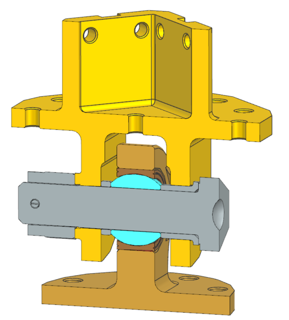

title: |  
  **Gimbal Mount Assembly**  
  Definition File
author: Artjom Lukanowski on behalf of The Exploration Company SAS     
version: "001"
date: "Version 001 created on \\today"
output:
  pdf_document:
    toc: true
    toc_depth: 3

header-includes:
  - \usepackage{titling}
  - \renewcommand{\maketitle}{
      \begin{titlepage}
        \thispagestyle{empty}
        \vspace*{\fill}
        \begin{center}
          {\huge\normalfont \thetitle\par}
          \vspace{2em}
          {\normalsize\normalfont \theauthor\par}
          \vspace{1em}
          {\normalsize\normalfont \thedate\par}
        \end{center}
        \vspace*{\fill}
      \end{titlepage}
    }
  - \usepackage[a4paper,left=20mm,right=20mm,top=25mm,bottom=25mm]{geometry}
  - \usepackage{fancyhdr}
  - \fancyhead[L]{\nouppercase{\leftmark}}
  - \pagestyle{fancy}
  - \fancyhf{}
  - \fancyhead[R]{Gimbal Mount Assembly - Requirement Consolidation - Version 001}
  - \renewcommand{\headrulewidth}{0.4pt}
  - \fancyfoot[C]{\thepage}
  - \usepackage{hyperref}
  - 
---
<!--An extension to these requierements are given in a Excel named "Huracan-TVC-Preliminary-Spec.xlsx" created by Pierre Vinet -->

\pagenumbering{roman}
\setcounter{page}{1}
\tableofcontents
\clearpage
\pagenumbering{arabic}

# Introduction
## Scope
The definition file serves as the identity card of the Gimbal Mount Assembly (GMA), detailing its intended capabilities and interactions with other systems. The document aims to provide a thorough understanding of the following key aspects:

• Overview of the components that constitute the GMA and their main purposes
• Identification of the operating characteristics and the main performance metrics 
• Description of the mechanical characteristics and interaction with the rest of the engine

##  Reference

[RD???] Huracan - Huracan System Definition File (PDR) - TEC-FRA-DOC-????? - Version ???

[RD1] Gimbal Mount Assembly Requirement Consolidation - Version 0

[RD?] PCB PIEZOTRONICS - Installation Drawing Mechanically Filtered Shock Accelerometer 1093 - Luebeck 2015

\clearpage

# GMA Overview
  ## Engine system context
 The Huracan engine system presented during the Preliminary Design Review (PDR) features a rigid thrust structure, that interfaces the main engine with the vehicle. The GNC-manouvers are originally intended to be realized by a Reaction Control System (RCS) for pitch, yaw and roll. For the on-Earth demonstrator *Oneiros* - that is planned to be driven by the Huracan engine - the pitch and yaw control shall be executed by a Thrust Vector Control system (TVC). The main mechanical components of the TVC are the Gimbal Mount Assembly (GMA) and two actuators. The focus of this Definition file here, is exclusively related to the development of the Gimbal Mount Assembly (GMA). 

  In the figure below, the GMA and its accomodation in the engine layout is shown. The location of the GMA is attached at the top of the Thrust Dome, that is interfacing the Injection Head on the other end. 

  FIGURE

  ## Role of the GMA in the Engine System
  The main role of the GMA is to provide the structural and kinematic connection between the engine´s Thrust Chamber Assembly (TCA) and the vehicle´s structure, while allowing controlled angular deflection of the engine. The GMA does not directly generate thrust, specific impulse, or combustion performance. However, it is strongly influenced by the engine-level performance and configuration because these parameters define the loads, deflections, actuator forces, alignment requirements, and environmental conditions that the assembly must withstand.

  The GMA shall therefore be considered as an interface and main mechanical load-path component between the engine and the vehicle, that transmits a nominal load of 15 kN (vacuum) and 10 kN (atmospheric). Among the nominal load, the GMA shall feature a operational gimbal capability of +/-10° per axis (pitch and yaw). 

  ## GMA Design Overview

Following the design philosophy *"safe, simple, achievable"*, the final design features 7 parts in total (4x COTS, 3x custom). The image below 

  ## Main components and Purposes

# Functional characteristics
  ## Main Functions

  ## Gimbal 

# Mechanical characteristics
  ## Connections and interfaces
  
  ## Materials and Mass
**Mass**
  The table below shows the total mass, estimated by the calculated CAD-mass and data sheets for COTS parts.

| **Part**| **CAD-ID** | **Material** | **Mass** |
| ------ | ----- | ------- |------- |
| GMA Clevis Head |126749/01| 17-4PH - H1025 | 0.864 kg |
| GMA Lug Head |124890/01| 17-4PH - H1025 | 0.381 kg |
| GMA GMA Bushing |126711/01| 17-4PH - H1025 | 0.0147 kg |
| GMA GMA Spacer |126707/01| 17-4PH - H1025 | 0.0003 kg |
| Bolt NAS6710DU29 |3423/01| CRES A286| 0.1316 kg |
| Nut MS9358-16 |3437/01| CRES A286| 0.0386 kg |
| PIN MS24665-374 |3489/01| CRES A286| 0.0022 kg |
| BEARING MS14103-10 |3489/01| 440C/17-4PH | 0.1089 kg|
| **Total mass** | ----- | ------- |**1.544 kg**|

Fasteners
| FASTENERS ISO4017 M6x16 16x|20881/01| A4-70 | 0.0978 kg|
| FASTENERS ISO4017 M6x25 8x|20883/01| A4-70 | 0.0648 kg|
| NUTS ISO4032-M6 8x|14483/01| A4-70 | 0.0219 kg|
| WASHERS ISO7092-6 32x|11263/01 | 200HV-A4| 0.0256 kg|
| PINS ISO8734-4x10|1603/01 | C1 | 0.0019kg|
| **Total mass** | ----- | ------- |**0.212 kg**|

The GMA with fasteners equals to an estimated total mass of approximately 1.8 kg in total. 

**Center of gravity**

  ## Mechanical Limits

# Cost assessment 

The costs envelope the price for procurement of each part and does not include internally related process costs (e.g. inspection).

| **Part**| **CAD-ID** | **Material** | **Est. cost** |
| ------ | ----- | ------- |------- |
| GMA Clevis Head |126749/01| 17-4PH - H1025 |532 €  |
| GMA Lug Head |124890/01| 17-4PH - H1025 | 241€ |
| GMA GMA Bushing |126711/01| 17-4PH - H1025 |  |
| GMA GMA Spacer |126707/01| 17-4PH - H1025 | |
| Bolt NAS6710DU29 |3423/01| CRES A286|  |
| Nut MS9358-16 |3437/01| CRES A286|  |
| PIN MS24665-374 |3489/01| CRES A286|  |
| **Total cost** | ----- | ------- |**1.435 kg**|

**Center of gravity**

# Conclusion

# Acronym List  
The acronyms used in this document are listed below.  

| **Acronym**  | **Definition**   |
|---|---|
|GMA|Gimbal Mount Assembly|
|IH|Injection Head|
|PDR| Preliminary Design Review 
|RCS|Reaction Control System|
|TCA|Thrust Chamber Assembly|
|TVC|Thrust Vector Control|