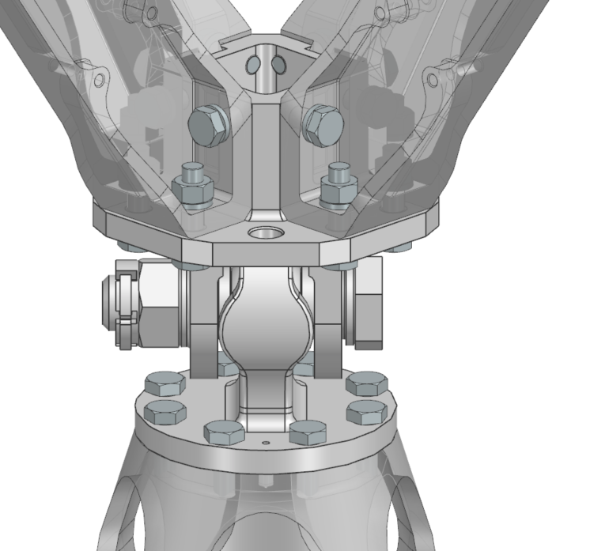
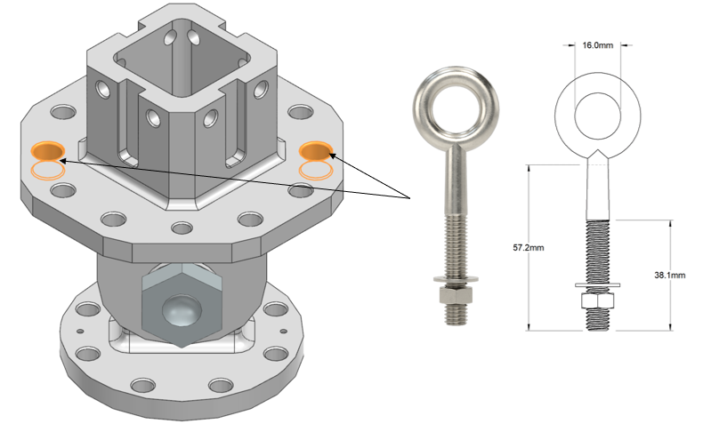

\pagenumbering{roman}
\setcounter{page}{1}
\clearpage
\pagenumbering{arabic}

# 1. Introduction
## 1.1. Scope  
This document identifies and defines the internal and external interfaces of the Gimbal Mount Assembly (GMA).   

## 1.2. Reference

[RD1] Nyx Moon - Huracan Development Logic / TEC-FRA-DOC-01004 / Issue 02 

[RD2] PCB PIEZOTRONICS / General Operating Guide / 2002

[RD3] Gimbal Mount Assembly - Definition File / Version 001 

\clearpage
 

# 2. Overview  
## 2.1. Engine System and GMA 
The figure shows the location of the GMA within the engine system, progressing from the complete engine assembly to a detailed view of the GMA.

{ width=100% }  

# 3. Interfaces  

## 3.1. Internal Interfaces: GMA
The internal interfaces comprise all joints that connect the GMA component. As shown in the exploded view below, the primary internal mechanical interface is the connection between the GMA Lug and Clevis Head. The joint is established by a single bolt-and-nut assembly and secured against loosening by a Cotter Pin.

{ width=50% }  

The controlled interface components and their material specifications are listed in Table 1. 

| **Interface Part** | **Material** |  **Quantity** | 
|---|---|---|
|Bolt NAS6710DU29       |A286            | 1 |
|Nut MS9358-16          |A286            | 1 |
|Cotter Pin MS24665-374 |AISI 302 or 304 | 1 |
: GMA Internal Interfaces  

## 3.2. External Interfaces: GMA and Engine/Vehicle 

The external interfaces encompass all joints connecting the GMA to the engine on one side and to the vehicle on the other.  

**Engine Interface**  
The GMA is attached to the Thrust Dome of the Thrust Chamber Assembly (TCA), as defined in [RD3]. Eight stainless-steel fasteners shall secure the interface and shall be distributed symmetrically around the flange. Two stainless-steel dowel pins shall provide interface alignment.

{ width=80% } 

| **Interface Part** | **Designation** | **Quantity** | 
|---|---|---|
| Hexagon head screw | ISO4017-M6x16-A4-70    | 8 |
| Dowel pin           |ISO8734-4x10-C1        | 2 |
: GMA-to-engine interface hardware

**Vehicle Interface**  
The GMA interfaces with the vehicle structure through four Thrust Frame Beams, as defined in [RD3]. Each Thrust Frame Beam interfaces with two M6 threaded holes, two Ø6.6 mm through-holes, and one centering feature on the GMA Clevis Head. Across all four Beams, the interface therefore comprises eight M6 threaded holes, eight Ø6.6 mm through-holes, and four centering features. The centering features align the Beams with the Clevis Head before the fasteners are tightened. 

{ width=70% }   

Table 3 show the total number of bolts, nuts, and washers required for the four Thrust Frame Beams.

| **Interface Part** | **Designation** | **Quantity** | 
|---|---|---|
| Hexagon head screw   | ISO4017-M6x16-A4-70    | 8 |
| Hexagon head screw   | ISO4017-M6x25-A4-70    | 8 |
| Hexagon regular nut  | ISO4032-M6-A4-70       | 8 |
| Plain washer         | ISO7092-6-200HV-A4     | 16 |
: GMA-to-vehicle interface hardware

Plain washers shall be used wherever the fasteners bear against softer materials, such as the aluminum Thrust Frame Beams. An overall view of the GMA with its adjacent parts to the engine respectively vehicle and fasteners is shown below.

{ width=40%}  

## 3.3. Handling and Transport Interfaces
Two M8 stainless-steel eyebolts shall be used for handling operations. Two symmetrically arranged Ø9 mm through-holes are provided in the GMA clevis-head flange, as shown in Figure 6.  

{ width=55% }  

 | **Interface type** | **Size** | **Material** | **Quantity** |
|---|---|---|---|
| Eyebolt | M8| AISI 316 |2 |
: Interface for GMA handling

## 3.4. Instrumentation Interface
For the current design state, a shock sensor is shall to be attached on the GMA. Three alternative 1/4-28 UNF-3B threaded mounting locations are provided on the GMA Clevis Head flange for installation of the shock accelerometer shown in Figure 7.  

 { width=55% } 

 | **Interface type** | **Manufacturer** | **Model** | **GMA Interface** | **Electrical Interface** |
|---|---|---|---|---|
| Shock Accelerometer | PCB PIEZOTRONICS|305C3 |1/4-28 UNF-3B  |10-32 UNF-2A coaxial plug |
: Interface for GMA instrumentation

\clearpage

# 4. Annex

## 4.1. Manufacturing drawings  

{ width=85% }  

{ width=50% }  

\clearpage  

## 4.2. Instrumentation  

![Installation drawing of shock accelerometer [RD3]](<../figures/ICD_GMA shock sensor.png>){ width=80% }

\clearpage  

# 5. Acronym List  
The acronyms used in this document are listed below.  

| **Acronym**  | **Definition**   |
|---|---|
|GMA  |Gimbal Mount Assembly|
|TCA  |Thrust Chamber Assembly|
: Acronyms

