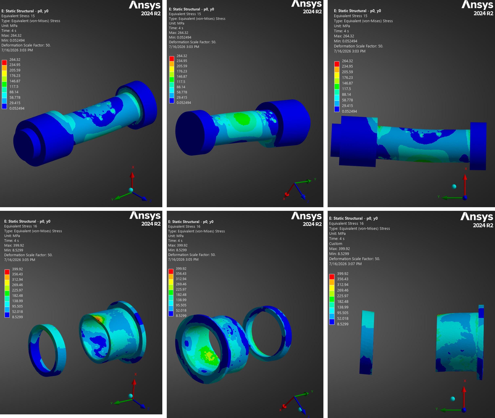

\pagenumbering{roman}
\setcounter{page}{1}
\clearpage
\pagenumbering{arabic}

# 1. Introduction
## 1.1. Scope  
This document presents the Design Justification File for the Gimbal Mount Assembly (GMA). Its purpose is to explain the rationale behind the selected design and demonstrate that it meets the baseline requirements specified in [RD01]. It lists and describes the justification for:  

- Functional Design
- Thermal Design
- Mechanical Design

##  1.2. Reference  

[RD01] Gimbal Mount Assembly - Requirement Consolidation / Version 001  

[RD02] Gimbal Mount Assembly - Definition File / Version 001  

[RD03] SKF Spherical Plain Bearings and Rod Ends / 2013  

[RD04] Bearings, Control System Components, and Associated Hardware Used in the Design and Construction of Aerospace Mechanical Systems and Subsystems / MIL-HDBK-5199 / 1997  

[RD05] RBC Aerospace FibriloidCR Series - Cryogenic Rated Plain Bearings: Sphericals, Rod Ends and Journals / 2024  

[RD06] SKF Aerospace Solutions / 2020  

[RD07] NASA Reference Publication 1228 / Fastener Design Manual / 1990  

[RD08] System Requirements Document / TEC-ITA-DOC-2025-01017 / Version 0  

[RD09] Huracan - Thrust Chamber Assembly Verificaiton Control Document / TEC-FRA-DOC-2024-01148 / Version 0  

[RD10] Gimbal Mount Assembly - Manufacturing, Assembly, Integration and Test Plan / Version 001  

[RD11] Data Sheet - ARMCO 17-4PH / 2022  

[RD12] Nyx Moon - Mechanical Design Rules / TEC-FRA-DOC-2026-01026 / Issue 1  

[RD13] Space engineering - Threaded fasteners handbook / ECSS-E-HB-32-23A Rev.1 / 2023  

[RD14] SKF spherical plain bearings and rod ends / 2023  

\clearpage

# 2. Functional Design  
## 2.1. Chosen Tolerances and fits  

**Figure 1** shows a cross-sectional view in which all radial interfaces are color-coded. **Table 1** summarizes the dimensional limits and resulting diametral fit range for each mating outside-diameter/inside-diameter interface. Positive fit values indicate clearance, while negative values indicate interference.
  
{width=10%}  

| **Mating parts** | **Shaft (mm)** | **Hole (mm)** | **Resulting Fit (mm)** |
|---|---|---|---| 
| \textcolor{blue}{Bearing \& Lug}     |30.1498–30.1625 |30.1570–30.1700 |**-0.0055 to +0.0202**|
| \textcolor{brown!60!black}{Bolt \& Bearing}    |15.8369–15.8496 |15.8623–15.8750 |**+0.0127 to +0.0381**|
| \textcolor{red}{Bolt \& Clevis}    |15.8369–15.8496 |15.8623–15.8750 |**+0.0127 to +0.0381**|
| \textcolor{green!60!black}{Bolt \& Bushing}    |15.8369–15.8496 |15.8623–15.8750 |**+0.0127 to +0.0381**|
| \textcolor{black}{Bolt \& Spacer}     |15.8369–15.8496 |15.8750–15.902  |**+0.0254 to +0.0651**|
| \textcolor{purple}{Bushing \& Clevis} |19.9800–19.9930 |20.0000–20.0210 |**+0.0070 to +0.0410**|
: Radial tolerances and fits  

The selection of the commercial off-the-shelf (COTS) MS14103-10 spherical bearing and NAS6710DU29 bolt constrains the available bearing and bolt-shank dimensions. The dimensions of the corresponding mating bores were selected to provide the required assembly clearances. The resulting bolt-to-bore clearances are also consistent with established bearing-supplier recommendations, including those provided by *SKF* [RD03].  

To simplify assembly and inspection and to minimize the precautions required during integration, a common close-clearance fit is used for most bolt-to-bore interfaces. The exception is the transition fit between the GMA lug-head bore and the spherical-bearing outer ring. During bolt tightening, the clearance at the bolt interfaces allows the components to align and seat axially without radial binding.  

The only transition fit in the assembly is between the GMA Lug Head bore and the Spherical Bearing outer ring. This fit intentionally differs from the generic recommendation in the Defense Handbook [RD04], which specifies a nominal 0.001-inch clearance fit.  

In contrast to the generic recommendation, *SKF* [RD03] distinguishes between housing fits according to the housing material and the expected loading conditions. For steel/PTFE-fabric spherical bearings subjected to heavier loads or shock loading, SKF recommends a tighter housing fit. Applying the recommended *K7*-housing-bore tolerance to the outside-diameter limits of the *MS14103-10* Spherical Bearing results in a calculated fit range of **-0.0180 to +0.0197 mm**.  

Other bearing suppliers, including RBC Aerospace [RD05] and NHBB [reference required], recommend a transition fit of approximately -0.005 to +0.020 mm for self-lubricating spherical bearings. The selected GMA dimensions produce a fit range of -0.0055 to +0.0202 mm, which closely matches this recommendation. This fit was selected because the GMA is expected to experience high oscillatory loads during steady-state operation and transient shock loads during ignition, shutdown, and combustion-instability events.   

In the event of a interference of **-0.0055 mm** between Spherical Bearing and Lug, the clearance fit is expected to remain between the Bolt and Bearing. As a conservative screening calculation, assuming that the full outer-ring diametral compression were transferred directly to the bearing bore would leave 0.0072 mm (0.0127 mm - 0.0055 mm) of diametral bolt-to-bearing clearance.  

It should also be noted that a tighter housing fit can alter the installed bearing clearance and decrease the bearing friction coefficient at a given temperature, as described qualitatively for self-lubricating spherical bearings by *SKF* [RD06].  

![Load and temperature dependend evolution of bearing friction coefficient [RD06]](<../figures/SKF_bearing friction.png>){width=10%}  

## 2.2. Tolerance Stack-Up Analysis  

A tolerance stack-up analysis is conducted with the objective to keep tolerances as tight as possible to maintain the design compact, reduce the roll-error (pivot on x-axis) and comply the geometrical constraints given by COTS parts utilized. **Figure 3** shows four cases of tolerance stack-up analysis performed to estimate the minimum and maximum clearance under worst-case considerations (absolute extreme tolerance limits)  

{width=10%}  

**Table 2** presents the related values calculated.

| **Stack-up** | **Nominal value (mm)** | **Max. value (mm)** | **Min. Value (mm)** |
|---|---|---|---| 
| 1 |0.3 |0.6 |0.1|
| 2 |0|0.0854 |0.015|
| 3 |1.225 |1.425 |0.904|
| 4 |0.699 |1.055 |0.395|
: Worst-Case Tolerance Analysis

## 2.3. Preload of NAS-bolt  

The Castellated Nut shall be tightened until all components of the axial joint stack are fully seated and unacceptable axial play is eliminated. From this seated condition, the nut shall be advanced in the tightening direction only to the first position at which a castellated slot aligns with the bolt cross-hole, after which the Cotter Pin shall be installed. 

Assuming the specified thread *0.6250-18 UNJF-3A*, the pitch is $p=\frac{1}{18}\,\text{inch}=1.41\,\text{mm}$.    

For a castellated nut with six equally spaced slots, the maximum angular advance required for alignment is 60°. The corresponding maximum relative axial thread advance is a pitch stated above. Taking into account that the Castellated Nut *MS9358-016* contains six grooves, the spacing between grooves is 60 °. Roughly, for an angle of rotation of 60 ° with the wrench, the relative thread advance is estimated by:

$\Delta$s$=\frac{60 \text{°}}{360\text{°}}\ * 1.41 mm=0.235\,\text{mm}$ 

This value represents the maximum relative nut advance after seating. It shall not be interpreted directly as bolt elongation because the imposed displacement is distributed between bolt extension, compression of the joint stack, and local deformation of the threads and bearing surfaces.

When an adjustment of 0.235 mm is applied in the ANSYS bolt-pretension model, the calculated preload is 63.4 kN. This result includes the modeled stiffness and contact behaviour of the bolt and clamped components but does not account for installation scatter, embedment, relaxation etc. 

The analysis with a friction coefficient of 0.2 for the stacked surfaces indicates that this preload significantly changes the lateral load path. Like Figure 4 demonstrates under thrust load (here 22.5 kN), a substantial portion of this load is transfered through friction rathern than through the intended bolt, bearing-inner-member, and clevis-hole contact path. Figure 5 shows the consequences of the preload directly mirrored by von Mises stresses. The values are for relative comparison only as the mesh might be too coarse to assess absolute values. In total it can be demonstrated, that the deformation shape of the NAS-bolt and adjacent parts remains mostly. Considering the von Mises stresses it is evident, that Spacer, Bushing and NAS-bolt exhibit a significant increase in stresses. Also, the scaled deformation shows how the frictional forces introduce a bending load particularily for the Bushing and Spacer. 

{width=10%}  

{width=10%}  

In summary, the **minimum torque is to be chosen so that axial play is eliminated**. The maximum torque is estimated so the main engine operational thrust force is not transmitted through the friction as exemplarily shown above. Specifically for the on-Earth demonstrator *Oneiros* a minimum thrust level of 6 kN is maintained through the entire duration as shown by the Guidance Navigation Control simulation (GNC) in Figure 6. Taking into account the *Alternative Torque Formula* by NASA [RD07] for quick bolt torque calculations, a **maximum preload for the NAS-bolt is approximated at 17 Nm**, which results in a axial preload of approximately 6 kN.  

![[GNC-simulation - Thrust requirement over Time]](<../figures/GNC_thrust level.png>){width=10%}  

# 3. Thermal Analysis  

For the thermal analyis, *ANSYS Workbench 2024 R2* is utilized. The results and related conclusions and comments are presented subsequently.

## 3.1. Results    

A transient thermal analysis was performed to support the definition of component tolerances specified in the Definition File [RD02] and to reduce the thermal-development risks associated with the main functional requirements of the GMA [RD01] and the *Oneiros* system requirements [RD08].  

As part of the preliminary GMA development, a transient thermal model was established. The generic boundary conditions are summarized in the table below and described in greater detail in the Annex.  

| **Thermal Boundary** | **Expression** | **Comment** | 
|---|---|---|
| Thermal load |90 K | Applied to Thrust Dome flange surface |
| Ambient Temperature |322.75 K |In accordance with [RD08]] |
| Flange connections |Bonded |Ideal thermal contact without interface resistance|
| Heat transfer |Thermal conduction |Radiation and convection neglected|
: Generic boundary conditions for the Transient Thermal Analysis

The calculated temperature distributions after mission durations of 60 s for *Oneiros* and up to 500 s for Terminal Moon are shown in **Figure 7**.  

{width=10%}  

A hot-fire duration of 60 s is planned for the *Oneiros* demonstrator [RD08]. The transient thermal-analysis results shown in **Figure7** indicate that, for this duration, no significant temperature gradients are expected in the GMA region containing components subject to relative motion, including the Spherical Bearing and NAS-bolt. 

The *Oneiros* demonstration is planned under atmospheric conditions. The present model neglects both convection and radiation and therefore does not represent all heat-transfer mechanisms present during the test. Neglecting convection may be conservative with respect to component cooling. The omission of radiation may likewise be conservative or non-conservative depending on the temperatures and view factors of the surrounding components. For a lunar mission, convection is absent, but radiative heat transfer between the vehicle, the lunar surface, and deep space must be considered in a mission-specific thermal analysis.  

A further simplifying assumption is the use of bonded thermal contacts at connected interfaces. This represents ideal, loss-free heat transfer across the flange connections and therefore neglects thermal contact resistance. In the physical assembly, the interface conductance will depend on surface condition, contact pressure, bolt preload, coatings, and interface geometry. For heat transfer from the Thrust Dome into the GMA, the bonded-contact assumption is generally conservative because it maximizes conductive heat transfer across the interfaces.  

Another simplification is the assumption of a 90 K thermal load. However, as stated in REQ-020 [RD01], the operating temperature under atmospheric conditions is expected to range from 120 K to 150 K. In contrast, the oxygen pump inlet temperature is expected to range from 90 K to 96 K [RD09].  

As per Definition File [RD02], the material for the Thrust Dome and all GMA parts apart from COTS are 17-4PH - H900. Specifically for the Thrust Dome, that is directly connected to Injection Head (IH), the minimum expected temperature can be a driving design parameter as the impact toughness drops with lower temperatures. **Figure 8** shows the temperature dependend material properties. A meaningful reduction of the Charpy V-notch can be seen once the temperature drops below -62 °C (211.15 K). For the Thrust Dome and the GMA Lug Head, the temperatures are to be carefully monitorend during tests [RD10]. Undershooting the temperature of -62 °C, can increase the risk for brittle fracture especially in shock occassions (e.g. Shut-Down)

![Typical Mechanical Properties of 17-4PH - H900 [RD11]](<../figures/17-4PH-H900 sub-zero properties.png>){width=10%}

Despite these simplifications, the analysis provides a useful preliminary estimate for both mission scenarios and identifies the expected thermal propagation path from the Thrust Dome toward the GMA. The calculated temperature distribution also provides initial guidance for potential future modifications to the Thrust Dome. For example, a reduction in Thrust Dome height would shorten the conductive heat path and could increase the thermal exposure of the GMA, potentially requiring corresponding design changes.  

For the current GMA configuration and the short-duration of the *Oneiros* test, the analysis indicates that significant thermal loads are not expected to reach the Lug Head in the vicinity of the Spherical Bearing seat. Consequently, thermal loads are not considered a governing sizing case for the current GMA development stage. This conclusion is limited to the analyzed geometry, boundary conditions, and mission durations and shall be reassessed following significant changes to the Thrust Dome geometry, mission duration, thermal environment, or interface definition. 

The FE-modeling assumptios are to be detailed and correlated in further justification loops by temperature measurements as recommended in the Manufacturing, Assembly, integration and Test Plan (MAIT) [RD10]. 

# 4. Mechanical Analysis  

## Bearing Lifetime  

The size of the Spherical Bearing is determined by the NAS-bolt grip diameter, which is chosen based on preliminary hand-calculations. Under the assumption of a quasi-static load of 22.5 kN [RD08], and unhindered bending (radial clearance), the results for a *NAS6710* bolt are shown in **Table???** without any additional safety factors.

| Load       | Stress [MPa] | Acceptable Yield [MPa] | Safety |
|----------  |--------------|----------|----------|
| **Bending**|  212.2       |    600      |   2.8  |
| **Shear**  |  76.1        |    348      |    4.5 |
: Preliminary dimensioning of NAS-bolt

The *NAS6710DU29* is chosen for the design, from which the Spherical Bearing *MS14103-10* results with a bore diameter of 0.625". 

Since no particular lifetime methods are provided by related military standards, the Basic Rating Life calculation by *SKF* [RD14] is taken to assess the lifetime of the maintanance-free steel/PTFE-fabric spherical bearing. 

A simulation is taken as a first estimate to calculate the rating life of the bearing. The analysis provides thrust load, pitch and yaw angle over time for the mission duration of the on-Earth demonstrator *Oneiros* (see **Figure ?? Annex**). A total of  **12805 h** (operating hours) is calculated to estimate the service life of the bearing.  

This value serves as a guidance until SKF-specific failure criteria are reached. For a Steel/PTFE-fabric spherical bearing, an increase in bearing clearance of 0.3 mm and a coefficient of friction of 0.15 is reached. In application-specific conditions it is sometimes not possible to quantify parameters like contamination, corrosion and complex kinematic load conditions. Due to these intangible effects, the basic rating life presented above can be attained or exceeeded. As recommended in [RD04], performance demonstration tests are important to built up experience w.r.t. bearing lifetime under operational conditions as they are expected to occur during the engines operation.  

It is important to mention that self-lubricated spherical bearings by *SKF* are tested in accordance to AS81820. Some testing parameters are mentioned below:

- Unidirectional radial load  
- Room Temperature  
- Oscillation: +/-25 °C (100° total per cycle)  
- Duration: 25000 cycles  
- Speed: 10 cycles per minute  

These testing parameters serve as a reference for the Basic Rating Life Calculation and the failure criteria stated above by *SKF*. Taking into account generic operational conditions of a rocket engine it is evitendly unavoidable to verify the bearings lifetime through loops of inspection and testing. For instance, the gimbal angle exhibit an operational deflection of +/- 12 ° under high oscillating thrust loads that change over frequency. 

For the application of the GMA, the service life is approached when a maximum allowable internal bearing clearance (wear) of 0.1 mm is reached. Under the testing parameters mentioned above, this value is equal to 5000 cycles in accordance to AS81820. Testing under thrust load shall give evidence to what extend the testing conditions in AS81820 are representative to estimate the wear and thus the bearings lifetime.

## 4.1. Static-Structural Analysis  
The mechanical analysis was performed using *ANSYS Workbench 2024 R2*. The results, together with the corresponding conclusions and comments, are presented in the following sections.  

A static structural finite element analysis was conducted for several pitch and yaw angle configurations. The purpose of evaluating these configurations was to identify potential mechanical risks associated with different gimbal positions, as illustrated in **Figure???**.  

{width=10%}  

A comparison of the simulation results showed that the overall stress and deformation levels remain low for all investigated configurations. Therefore, the configuration with pitch and yaw angles of 0 °, representing the neutral position, is used as the primary reference case in this document.  

Selected components are evaluated separately where their loading or stress distribution depends significantly on the gimbal angle. Since the GMA is not expected to be subjected to launch-induced acceleration yet, the analysis presented in this chapter focuses primarily on the thrust load generated by the engine. Additional results for the neutral configuration are provided in the Annex. More detailed results are available in the simulation files included with this deliverable.  
d
### 4.1.1. GMA - pitch 0°, yaw 0° under Thrust Load
The ungimbaled configuration describes the neutral position of the GMA for pitch and yaw and 0°. Generic boundary conditions that are considered in this analysis can be seen in **Table ???** followed by the presentation of results. A detailed description of the boundaries is attached in the Annex. The results shown are related to the load case, where the GMA is subjected to the thrust load as this is the prioritized load scenario for the on-Earth demonstration. Nevertheless, a theoretical vehicle acceleration is included in the load cases and can be extracted in the delivered data package. 

| **Mechanical Boundary** | **Expression** | **Comment** | 
|---|---|---|
| Mechanical thrust load| 22.5 kN | 1.5*15 kN under vacuum |
| Mechanical Fixation |Fixed support |All degrees of freedom locked|
| Main flange connections |$\mu$=0.2 |Frictional| 
| Axial part connections |Frictional $\mu$=0.2 |Frictional between NAS-bolt and Nut| 
| Radial part connections |Frictionless |Radially to mating parts w.r.t. NAS-bolt| 
| Fasteners |Ø6 Beams |Rigid Beams for all fasteners |  
: Generic boundary conditions for the Static-Structural Analysis

#### 4.1.1.1. Results: Contact  

Chosen contact results are shown in this chapter. 

{width=10%}  

The contact status shown in **Figure ???** demonstrates where sliding occurs due to initiation of the thrust load in the FE-model. Among the deformation results of the GMA and the reaction forces demonstrated in **Figure ??? Annex**, this plot underlines the positive plausibility of this model.  

{width=10%}  

The frictional stresses (**Figure ???**) also show, that the quasi-static thrust load of 22.5 kN exceeds the pretension of the NAS-bolt (6 kN), which results in sliding and max. frictional stresses of approximately 35 MPa. 

#### 4.1.1.2. Results: Deformation  

The deformation results of the GMA analysis for a quasi-static thrust loa dof 22.5 kN are shown below.

{width=10%}  

{width=10%}  

The global deformation is predominantly oriented in the positive x-direction. The deformation pattern is symmetric in the x–z plane, whereas a rotation about the z-axis can be observed in the x–y plane. This behavior is assumed to result from the different bore geometries of the GMA Lug Head, which distribute the load transmitted through the NAS-bolt.

Considering the modeled contact between the inner and outer races of the Spherical Bearing, as described in **Chapter ???**, the relative total deformation at the location of minimum clearance between the Clevis Head and the Lug Head is approximately 0.1 mm, as shown in **Figure???**.

The bonded-contact definition between the inner and outer bearing races represents a modeling simplification. The PTFE-fabric liner is expected to have a lower stiffness than assumed in the present analysis. Consequently, a greater relative deformation in the x-direction between the Lug Head and the Clevis Head is expected in the actual assembly.

#### 4.1.1.3. Results: Stresses  

The figures below show the von Mises Stresses from the global GMA component up to its single parts. 

{width=10%}

{width=10%}  

{width=10%}  

The highest stresses occur locally at the inner edges of the Clevis Head bores and are caused by the clearance fits between the assembled parts, namely the NAS-bolt and the Bushing. The maximum von Mises stress remains below 405 MPa. Since this stress peak is highly localized, the calculated value is more than 50 % below the yield strength of the specified 17-4PH-H900 material at ambient temperature.

The scaled deformation results also show qualitatively that the asymmetric design of the Clevis HJead leads to different stiffnesses of the two clevis ears through which the thrust load is transmitted. In the x–y plane, the left ear deforms further inward in the negative y-direction, whereas the right ear remains nearly undeformed. This difference in stiffness is also reflected in the stress distribution, with higher stresses occurring on the inner side of the left ear due to bending induced by the NAS-bolt.  

### 4.1.2. Chosen parts under Thrust Load  

In this chapter, FE-results are shown from chosen parts at specific gimbal angels other then the neutral position at pitch and yaw at 0 °.

This section presents the finite element results for selected components at specific gimbal-angle configurations other than the neutral position, defined by pitch and yaw angles of 0 °.

**Figure???** shows the directional deformation for a gimbaled configuration with a pitch angle of 12 ° and a yaw angle of -12 °. In this load case, the relative deformation between the GMA Lug Head Anti-Roll Feature and the inner surface of the clevis-head ear is highest compared to the other FE-Models with approximately 0.16 mm.  

{width=10%}

Due to the extreme deflection of the Lug Head, the a bigger area of the *weaker* Clevis Head Ear is subjected to higher bending stresses as can be seen in **Figure???**. The maximum stresses remain in edge areas of the Clevis Head, similarly to the ungimbaled FE-Model.

{width=10%}  

The Clevis Lug Head in the figure below exhibits a gimbal-angle independent stress distribution. However, the absolute von Mises stress level may increase as exemplarily shown below. The stress peaks location remains. 

{width=10%}  

**Figure ???** visualizes the von Mises Stresses of the Bushing and Spacer. This gimbal angle loads the parts most. For the Bushing and Spacer in particular it can be said, that the location of the pressure ellipse changes only slightly with changing pitch and yaw manouvers. 

{width=10%}  

Overall, the FE-Modell 4 (**Figure???**) exhibits slightly higher stresses compared to the nominal results presented in **Section???**. Still, with stress levels more than 50 % below the materials yield strength, the GMA is considered to be desgined conservative from a static-stractural point of view. 

### 4.1.3. Flange Fasteners  

#### 4.1.3.1. Results: Force Reaction

This section presents the reaction forces of the fasteners connecting the GMA to the Thrust Frame Beams on the upper, vehicle-side interface and to the Thrust Dome on the lower, engine-side interface. Prior to the application of the external load, all fasteners are preloaded to 6850 N. **Figure ??** and **Figure ??** presents the reaction forces after application of the Thrust Load.  

{width=10%}   

{width=10%}  

#### 4.1.3.2. Results: Margin of Safety & Torques

The justification for the fasteners calculated in this document are based on [RD13], while Safety and Design Factors are derived from [RD12]. For the calculation of the Margin of Safey (MOS), following factors for the fasteners are considered:

- SF_yield: 1.2 * 1.2 * 1.25=1.8 ( Model Factor, Project Factor, Yield Factor for fastener)  
- SF_ultimate: 1.2 * 1.2 * 1.55=2.2 ( Model Factor, Project Factor, Ultimate Factor for fastener)  
- SF_separation: 1.2 * 1.2 * 1.4=2.0 ( Model Factor, Project Factor, Separation factor for fastener)  
- SF_sliding: 1.2 * 1.2 * 1.4=2.0 ( Model Factor, Project Factor, Sliding factor for fastener)  

The calculation is executed with the TEC-internal Tool *BOLTEC*, which carries the justification logic and formulas in accordance to [RD14].  

**MOS**  
The reaction forces of the fasteners are shown in **Figure???** for all investigated gimbaled orientation between Lug Head and Clevis Head (see **Figure??**). It can be seen that the reaction forces of all fasteners barely differ with respect to each other.  

For a conservative justification, the max. axial pulling force and its related shear force is extracted and verified by analysis. The fastener that is relaxed highest due to pushing forces, exhibits a relaxation of smaller then 5 % relatively to the initial mounting pretension of the M6 fastener. Since this reduction of preload is considered small, the pushing forces are not analysed. 

In alignment with the dedicated numbering for each fastener in **Figure???**, the fastener that is stressed highest by pulling forces, is justified. The MOS shown below:

{width=10%}  

To highlight is that the extracted shear reaction forces exhibit a max. values of 717 N (e.g. pitch/yaw at 12°/0°), which is reflected in negative MOS for Slipping. These values are to be treated with care as no Dowel Pins are considered in the FEA. In reality, shear loads shall be carried by the Dowel Pins on the first place, before threaded fasteners are significantly subjected to shear. The remaining MOS are positive and not of concern in the frame of the static-structural assumption.  

**Torques** 

Since the load reaction forces of the fasteners do not differ significantly with respect to each other and the friction assumptions are the same across all interfaces, an uniform torque for all M6 fasteners of **7.2 Nm** is to be applied.  

\clearpage  

# 5. Annex  

## 5.1. Tolerance Stack Analyis  

{width=90%}  

{width=90%}  

{width=90%}  

{width=90%}    
  
## 5.2. Boundary Conditions Thermal Analysis  

{width=70%}    

{width=80%}   

{width=70%}    

{width=60%}    
  
## 5.3. Boundary Conditions Static-Structural Analysis  

{width=60%}   

{width=60%}  

{width=80%}    

{width=80%}    

{width=60%}  

{width=80%}  

{width=70%}   

{width=70%}    

{width=70%}  

## GNC data for Basic Rating Life of Spherical Bearing  

{width=70%}  

{width=70%}  

## 5.4. Static-Structural: GMA - pitch 0°, yaw 0° - Acceleration Load  

{width=80%}  

{width=80%}  

{width=80%}  

## 5.5. Static-Structural: Thrust Dome / Beams - Thrust Load 

{width=80%}  

{width=80%}  

## 5.6. Static-Structural: Thrust Dome / Beams - Acceleration Load  

![Thrust Dome von Mises Stresses - Acceleration Load - pitch 0°/yaw 0°]](<../figures/FEM_stress_acceleration_thrust dome.png>){width=80%}  

{width=80%}   

\clearpage  

# 6. Acronym List  
The acronyms used in this document are listed below.  

| **Acronym**  | **Definition**   |
|---|---|
|COTS|Commercial Off-The-Shelf|
|GNC|Guidance Navigation Control|
|GMA|Gimbal Mount Assembly|
|IH|Injection Head|
|MAIT|Manufacturing, Assembly, Integration and Test|
|MOS|Margin Of Safety|
