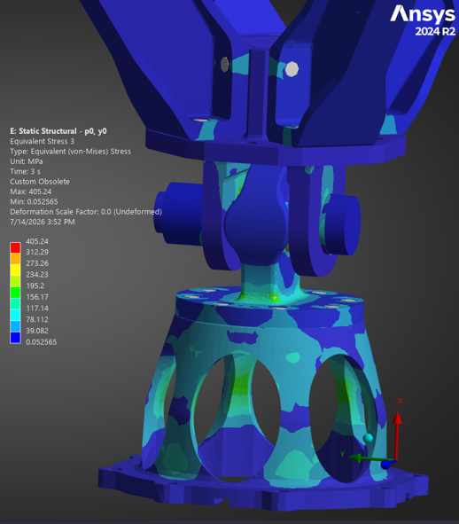
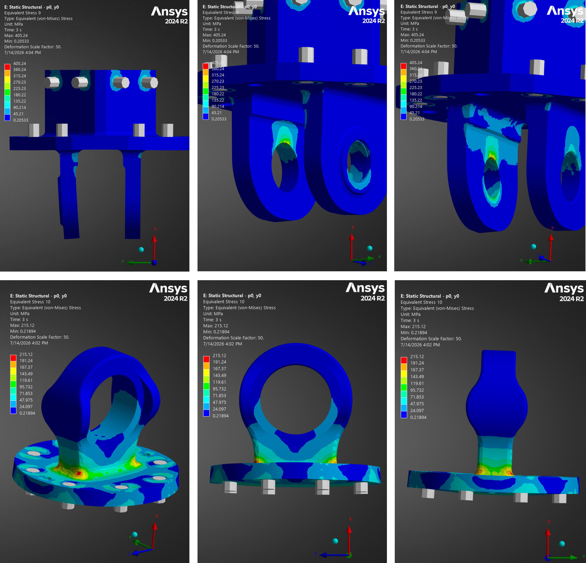
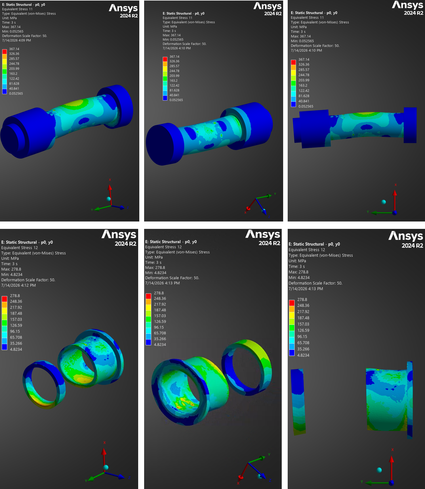
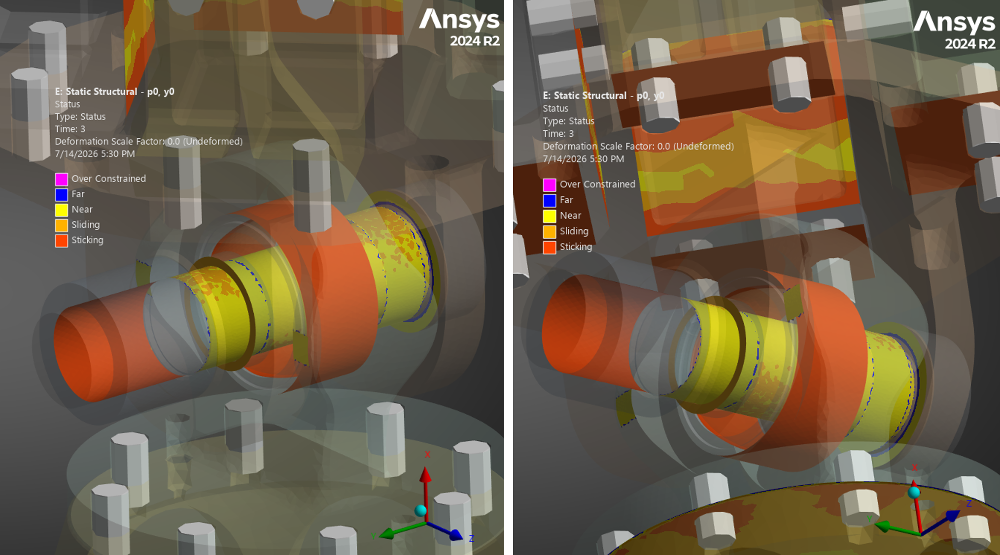
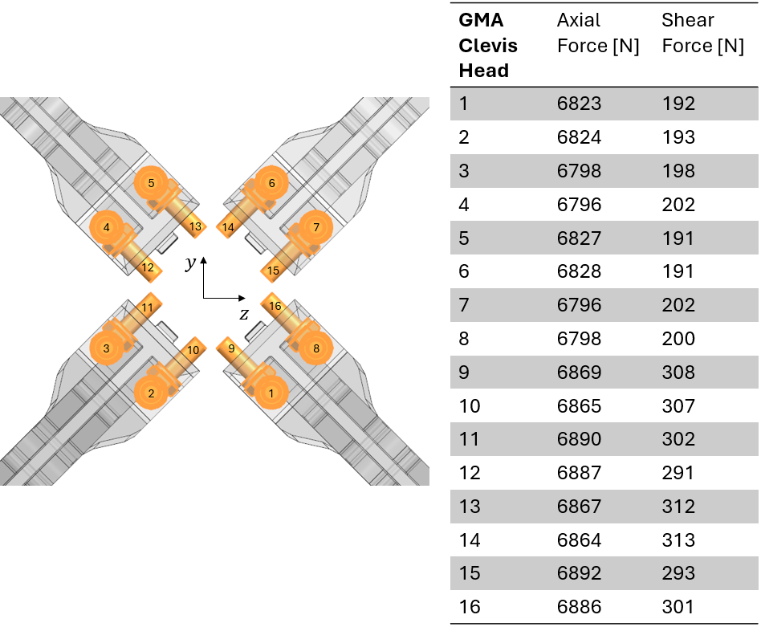
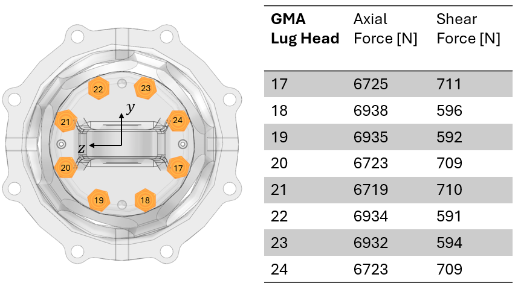

\pagenumbering{roman}
\setcounter{page}{1}
\clearpage
\pagenumbering{arabic}

# 1. Introduction
## 1.1. Scope  
This document presents the Design Justification File for the Gimbal Mount Assembly (GMA). Its purpose is to explain the rationale behind the selected design and demonstrate that it meets the baseline requirements specified in [RD01]. It lists and describes the justification for:  

- Functional Design
- Thermal Design
- Mechanical Design

##  1.2. Reference  

[RD01] Gimbal Mount Assembly - Requirement Consolidation / Version 001  

[RD02] Gimbal Mount Assembly - Definition File / Version 001  

[RD03] SKF Spherical Plain Bearings and Rod Ends / 2013  

[RD04] Bearings, Control System Components, and Associated Hardware Used in the Design and Construction of Aerospace Mechanical Systems and Subsystems / MIL-HDBK-5199 / 1997  

[RD05] RBC Aerospace FibriloidCR Series - Cryogenic Rated Plain Bearings: Sphericals, Rod Ends and Journals / 2024  

[RD06] SKF Aerospace Solutions / 2020  

[RD07] NASA Reference Publication 1228 / Fastener Design Manual / 1990  

[RD08] System Requirements Document / TEC-ITA-DOC-2025-01017 / Version 0  

[RD09] Huracan - Thrust Chamber Assembly Verificaiton Control Document / TEC-FRA-DOC-2024-01148 / Version 0  

[RD10] Gimbal Mount Assembly - Manufacturing, Assembly, Integration and Test Plan / Version 001  

[RD11] Data Sheet - ARMCO 17-4PH / 2022

\clearpage

# 2. Functional Design  
## 2.1. Chosen Tolerances and fits  

**Figure 1** shows a cross-sectional view in which all radial interfaces are color-coded. **Table 1** summarizes the dimensional limits and resulting diametral fit range for each mating outside-diameter/inside-diameter interface. Positive fit values indicate clearance, while negative values indicate interference.
  
{width=25%}  

| **Mating parts** | **Shaft (mm)** | **Hole (mm)** | **Resulting Fit (mm)** |
|---|---|---|---| 
| \textcolor{blue}{Bearing \& Lug}     |30.1498–30.1625 |30.1570–30.1700 |**-0.0055 to +0.0202**|
| \textcolor{brown!60!black}{Bolt \& Bearing}    |15.8369–15.8496 |15.8623–15.8750 |**+0.0127 to +0.0381**|
| \textcolor{red}{Bolt \& Clevis}    |15.8369–15.8496 |15.8623–15.8750 |**+0.0127 to +0.0381**|
| \textcolor{green!60!black}{Bolt \& Bushing}    |15.8369–15.8496 |15.8623–15.8750 |**+0.0127 to +0.0381**|
| \textcolor{black}{Bolt \& Spacer}     |15.8369–15.8496 |15.8750–15.902  |**+0.0254 to +0.0651**|
| \textcolor{purple}{Bushing \& Clevis} |19.9800–19.9930 |20.0000–20.0210 |**+0.0070 to +0.0410**|
: Radial tolerances and fits  

The selection of the commercial off-the-shelf (COTS) MS14103-10 spherical bearing and NAS6710DU29 bolt constrains the available bearing and bolt-shank dimensions. The dimensions of the corresponding mating bores were selected to provide the required assembly clearances. The resulting bolt-to-bore clearances are also consistent with established bearing-supplier recommendations, including those provided by *SKF* [RD03].  

To simplify assembly and inspection and to minimize the precautions required during integration, a common close-clearance fit is used for most bolt-to-bore interfaces. The exception is the transition fit between the GMA lug-head bore and the spherical-bearing outer ring. During bolt tightening, the clearance at the bolt interfaces allows the components to align and seat axially without radial binding.  

The only transition fit in the assembly is between the GMA Lug Head bore and the Spherical Bearing outer ring. This fit intentionally differs from the generic recommendation in the Defense Handbook [RD04], which specifies a nominal 0.001-inch clearance fit.  

In contrast to the generic recommendation, *SKF* [RD03] distinguishes between housing fits according to the housing material and the expected loading conditions. For steel/PTFE-fabric spherical bearings subjected to heavier loads or shock loading, SKF recommends a tighter housing fit. Applying the recommended *K7*-housing-bore tolerance to the outside-diameter limits of the *MS14103-10* Spherical Bearing results in a calculated fit range of **-0.0180 to +0.0197 mm**.  

Other bearing suppliers, including RBC Aerospace [RD05] and NHBB [reference required], recommend a transition fit of approximately -0.005 to +0.020 mm for self-lubricating spherical bearings. The selected GMA dimensions produce a fit range of -0.0055 to +0.0202 mm, which closely matches this recommendation. This fit was selected because the GMA is expected to experience high oscillatory loads during steady-state operation and transient shock loads during ignition, shutdown, and combustion-instability events.   

In the event of a interference of **-0.0055 mm** between Spherical Bearing and Lug, the clearance fit is expected to remain between the Bolt and Bearing. As a conservative screening calculation, assuming that the full outer-ring diametral compression were transferred directly to the bearing bore would leave 0.0072 mm (0.0127 mm - 0.0055 mm) of diametral bolt-to-bearing clearance.  

It should also be noted that a tighter housing fit can alter the installed bearing clearance and decrease the bearing friction coefficient at a given temperature, as described qualitatively for self-lubricating spherical bearings by *SKF* [RD06].  

![Load and temperature dependend evolution of bearing friction coefficient [RD06]](<../figures/SKF_bearing friction.png>){width=55%}  

## 2.2. Tolerance Stack-Up Analysis  

A tolerance stack-up analysis is conducted with the objective to keep tolerances as tight as possible to maintain the design compact, reduce the roll-error (pivot on x-axis) and comply the geometrical constraints given by COTS parts utilized. **Figure 3** shows four cases of tolerance stack-up analysis performed to estimate the minimum and maximum clearance under worst-case considerations (absolute extreme tolerance limits)  

{width=60%}  

**Table 2** presents the related values calculated.

| **Stack-up** | **Nominal value (mm)** | **Max. value (mm)** | **Min. Value (mm)** |
|---|---|---|---| 
| 1 |0.3 |0.6 |0.1|
| 2 |0|0.0854 |0.015|
| 3 |1.225 |1.425 |0.904|
| 4 |0.699 |1.055 |0.395|
: Worst-Case Tolerance Analysis

## 2.3. Preload of NAS-bolt  

The Castellated Nut shall be tightened until all components of the axial joint stack are fully seated and unacceptable axial play is eliminated. From this seated condition, the nut shall be advanced in the tightening direction only to the first position at which a castellated slot aligns with the bolt cross-hole, after which the Cotter Pin shall be installed. 

Assuming the specified thread *0.6250-18 UNJF-3A*, the pitch is $p=\frac{1}{18}\,\text{inch}=1.41\,\text{mm}$.    

For a castellated nut with six equally spaced slots, the maximum angular advance required for alignment is 60°. The corresponding maximum relative axial thread advance is a pitch stated above. Taking into account that the Castellated Nut *MS9358-016* contains six grooves, the spacing between grooves is 60 °. Roughly, for an angle of rotation of 60 ° with the wrench, the relative thread advance is estimated by:

$\Delta$s$=\frac{60 \text{°}}{360\text{°}}\ * 1.41 mm=0.235\,\text{mm}$ 

This value represents the maximum relative nut advance after seating. It shall not be interpreted directly as bolt elongation because the imposed displacement is distributed between bolt extension, compression of the joint stack, and local deformation of the threads and bearing surfaces.

When an adjustment of 0.235 mm is applied in the ANSYS bolt-pretension model, the calculated preload is 63.4 kN. This result includes the modeled stiffness and contact behaviour of the bolt and clamped components but does not account for installation scatter, embedment, relaxation etc. 

The analysis with a friction coefficient of 0.2 for the stacked surfaces indicates that this preload significantly changes the lateral load path. Like Figure 4 demonstrates under thrust load (here 22.5 kN), a substantial portion of this load is transfered through friction rathern than through the intended bolt, bearing-inner-member, and clevis-hole contact path. Figure 5 shows the consequences of the preload directly mirrored by von Mises Stresses. The values are for relative comparison only as the mesh might be too coarse to assess absolute values. In total it can be demonstrated, that the deformation shape of the NAS-bolt and adjacent parts remains mostly. Considering the von Mises Stresses it is evident, that Spacer, Bushing and NAS-bolt exhibit a significant increase in stresses. Also, the scaled deformation shows how the frictional forces introduce a bending load particularily for the Bushing and Spacer. 

{width=85%}  

{width=90%}  

In summary, the **minimum torque is to be chosen so that axial play is eliminated**. The maximum torque is estimated so the main engine operational thrust force is not transmitted through the friction as exemplarily shown above. Specifically for the on-Earth demonstrator *Oneiros* a minimum thrust level of 6 kN is maintained through the entire duration as shown by the Guidance Navigation Control simulation (GNC) in Figure 6. Taking into account the *Alternative Torque Formula* by NASA [RD07] for quick bolt torque calculations, a **maximum preload for the NAS-bolt is approximated at 17 Nm**, which results in a axial preload of approximately 6 kN.  

![[GNC-simulation - Thrust requirement over Time]](<../figures/GNC_thrust level.png>){width=80%}  

# 3. Thermal Analysis  
## 3.1. Results    

A transient thermal analysis was performed to support the definition of component tolerances specified in the Definition File [RD02] and to reduce the thermal-development risks associated with the main functional requirements of the GMA [RD01] and the *Oneiros* system requirements [RD08].  

As part of the preliminary GMA development, a transient thermal model was established. The generic boundary conditions are summarized in the table below and described in greater detail in the Annex.  

| **Thermal Boundary** | **Expression** | **Comment** | 
|---|---|---|
| Thermal load |90 K | Applied to Thrust Dome flange surface |
| Ambient Temperature |322.75 K |In accordance with [RD08]] |
| Flange connections |Bonded |Ideal thermal contact without interface resistance|
| Heat transfer |Thermal conduction |Radiation and convection neglected|
: Generic boundary conditions for the Transient Thermal Analysis

The calculated temperature distributions after mission durations of 60 s for *Oneiros* and up to 500 s for Terminal Moon are shown in **Figure 7**.  

{width=50%}  

\clearpage
## 3.2. Conclusion  

A hot-fire duration of 60 s is planned for the *Oneiros* demonstrator [RD08]. The transient thermal-analysis results shown in **Figure7** indicate that, for this duration, no significant temperature gradients are expected in the GMA region containing components subject to relative motion, including the Spherical Bearing and NAS-bolt. 

The *Oneiros* demonstration is planned under atmospheric conditions. The present model neglects both convection and radiation and therefore does not represent all heat-transfer mechanisms present during the test. Neglecting convection may be conservative with respect to component cooling. The omission of radiation may likewise be conservative or non-conservative depending on the temperatures and view factors of the surrounding components. For a lunar mission, convection is absent, but radiative heat transfer between the vehicle, the lunar surface, and deep space must be considered in a mission-specific thermal analysis.  

A further simplifying assumption is the use of bonded thermal contacts at connected interfaces. This represents ideal, loss-free heat transfer across the flange connections and therefore neglects thermal contact resistance. In the physical assembly, the interface conductance will depend on surface condition, contact pressure, bolt preload, coatings, and interface geometry. For heat transfer from the Thrust Dome into the GMA, the bonded-contact assumption is generally conservative because it maximizes conductive heat transfer across the interfaces.  

Another simplification is the assumption of a 90 K thermal load. However, as stated in REQ-020 [RD01], the operating temperature under atmospheric conditions is expected to range from 120 K to 150 K. In contrast, the oxygen pump inlet temperature is expected to range from 90 K to 96 K [RD09].  

As per Definition File [RD02], the material for the Thrust Dome and all GMA parts apart from COTS are 17-4PH - H900. Specifically for the Thrust Dome, that is directly connected to Injection Head (IH), the minimum expected temperature can be a driving design parameter as the impact toughness drops with lower temperatures. **Figure 8** shows the temperature dependend material properties. A meaningful reduction of the Charpy V-notch can be seen once the temperature drops below -62 °C (211.15 K). For the Thrust Dome and the GMA Lug Head, the temperatures are to be carefully monitorend during tests [RD10]. Undershooting the temperature of -62 °C, can increase the risk for brittle fracture especially in shock occassions (e.g. Shut-Down)

![Typical Mechanical Properties of 17-4PH - H900 [RD11]](<../figures/17-4PH-H900 sub-zero properties.png>){width=80%}

Despite these simplifications, the analysis provides a useful preliminary estimate for both mission scenarios and identifies the expected thermal propagation path from the Thrust Dome toward the GMA. The calculated temperature distribution also provides initial guidance for potential future modifications to the Thrust Dome. For example, a reduction in Thrust Dome height would shorten the conductive heat path and could increase the thermal exposure of the GMA, potentially requiring corresponding design changes.  

For the current GMA configuration and the short-duration of the *Oneiros* test, the analysis indicates that significant thermal loads are not expected to reach the Lug Head in the vicinity of the Spherical Bearing seat. Consequently, thermal loads are not considered a governing sizing case for the current GMA development stage. This conclusion is limited to the analyzed geometry, boundary conditions, and mission durations and shall be reassessed following significant changes to the Thrust Dome geometry, mission duration, thermal environment, or interface definition. 

The FE-modeling assumptios are to be detailed and correlated in further justification loops by temperature measurements as recommended in the Manufacturing, Assembly, integration and Test Plan (MAIT) [RD10]. 

# 4. Mechanical Analysis  

## Static-Structural: GMA - pitch 0°, yaw 0°  
The ungimbaled configuration demonstrates the neutral position of the GMA. Generic boundary conditions that are considered in this analysis can be seen in **Table ???**. A detailed description of the boundaries is attached in the Annex. 

| **Mechanical Boundary** | **Expression** | **Comment** | 
|---|---|---|
| Mechanical thrust load| 22.5 kN | 1.5*15 kN under vacuum |
| Vehicle Acceleration |-11.8 kN |30 * 9.816 m/s^2 * 40 kg |
| Mechanical Fixation |Fixed support |All degrees of freedom locked|
| Main flange connections |$\mu$=0.2 |Frictional| 
| Axial part connections |Frictional $\mu$=0.2 |Frictional between NAS-bolt and Nut| 
| Radial part connections |Frictionless |Radially to mating parts w.r.t. NAS-bolt| 
| Fasteners |Ø6 Beams |Rigid Beams for all fasteners |  
: Generic boundary conditions for the Static-Structural Analysis

### Results: Deformation  
{width=100%}  

{width=100%}  

### Results: Stresses  
{width=100%}

{width=100%}  

{width=100%}  

### Results: Contact  
{width=100%} 

{width=100%} 

### Results: Fasteners  

{width=100%}  

{width=100%}  

| **Fastener** | **Preload [kN]** | **Torque [Nm]** | 
|---|---|---|
| ISO4017-M6x16-A4-70 |6850|**???** |
| ISO4017-M6x16-A4-70 |6850|**???**|
| ISO4017-M6x25-A4-70 |6850|**???**|

### GMA - pitch ???°, yaw ???°
#### Results: Deformation
#### Results: Stresses
#### Results: Contact
#### Results: Fasteners

# 6. Annex  

## 6.1. Tolerance Stack Analyis  
(width=80%)

(width=80%)

(width=80%)

(width=80%)  

## 6.2. NAS-bolt torque calculation

## 6.3. Boundary Conditions Thermal Analysis 

## 6.4. Boundary Conditions Static Structural Analysis  

# 7. Acronym List  
The acronyms used in this document are listed below.  

| **Acronym**  | **Definition**   |
|---|---|
|COTS|Commercial Off-The-Shelf|
|GNC|Guidance Navigation Control|
|GMA|Gimbal Mount Assembly|
|IH|Injection Head|
|MAIT|Manufacturing, Assembly, integration and Test|

