\pagenumbering{roman}
\setcounter{page}{1}
\clearpage
\pagenumbering{arabic}

# 1. Introduction
## 1.1. Scope  
This document presents the Design Justification File for the Gimbal Mount Assembly (GMA). Its purpose is to explain the rationale behind the selected design and demonstrate that it meets the baseline requirements specified in [RD01]. It lists and describes the justification for:  

- Functional Design
- Thermal Design
- Mechanical Design

##  1.2. Reference  

[RD01] Gimbal Mount Assembly - Requirement Consolidation / Version 001  

[RD02] Gimbal Mount Assembly - Definition File / Version 001  

[RD03] SKF Spherical Plain Bearings and Rod Ends / 2013  

[RD04] Bearings, Control System Components, and Associated Hardware Used in the Design and Construction of Aerospace Mechanical Systems and Subsystems / MIL-HDBK-5199 / 1997  

[RD05] RBC Aerospace FibriloidCR Series - Cryogenic Rated Plain Bearings: Sphericals, Rod Ends and Journals / 2024  

[RD06] SKF Aerospace Solutions / 2020  

[RD07] NASA Reference Publication 1228 / Fastener Design Manual / 1990  

[RD08] System Requirements Document / TEC-ITA-DOC-2025-01017 / Version 0  

[RD09] Huracan - Thrust Chamber Assembly Verificaiton Control Document / TEC-FRA-DOC-2024-01148 / Version 0  

[RD10] Gimbal Mount Assembly - Manufacturing, Assembly, Integration and Test Plan / Version 001  

[RD11] Data Sheet - ARMCO 17-4PH / 2022  

[RD12] Nyx Moon - Mechanical Design Rules / TEC-FRA-DOC-2026-01026 / Issue 1  

[RD13] Space engineering - Threaded fasteners handbook / ECSS-E-HB-32-23A Rev.1 / 2023  

[RD14] SKF spherical plain bearings and rod ends / 2023  

[RD15] Bearings, Plain, Self-Aligning, Self-Lubricating, Low-Speed Oscillation, General Specification / MIL-B-81820-D / 1979 

\clearpage

# 2. Functional Design  
## 2.1. Tolerances and Fits  

Figure 1 shows a cross-sectional view in which all radial interfaces are color-coded. Table 1 summarizes the dimensional limits and resulting diametral fit range for each mating outside-diameter/inside-diameter interface. Positive fit values indicate clearance, while negative values indicate interference.
  
{width=40%}  

| **Mating parts** | **Shaft (mm)** | **Hole (mm)** | **Resulting Fit (mm)** |
|---|---|---|---| 
| \textcolor{blue}{Bearing \& Lug}     |30.1498–30.1625 |30.1570–30.1700 |**-0.0055 to +0.0202**|
| \textcolor{brown!60!black}{Bolt \& Bearing}    |15.8369–15.8496 |15.8623–15.8750 |**+0.0127 to +0.0381**|
| \textcolor{red}{Bolt \& Clevis}    |15.8369–15.8496 |15.8623–15.8750 |**+0.0127 to +0.0381**|
| \textcolor{green!60!black}{Bolt \& Bushing}    |15.8369–15.8496 |15.8623–15.8750 |**+0.0127 to +0.0381**|
| \textcolor{black}{Bolt \& Spacer}     |15.8369–15.8496 |15.8750–15.902  |**+0.0254 to +0.0651**|
| \textcolor{purple}{Bushing \& Clevis} |19.9800–19.9930 |20.0000–20.0210 |**+0.0070 to +0.0410**|
: Radial tolerances and fits  

The selection of the commercial off-the-shelf (COTS) *MS14103-10* Spherical Bearing and *NAS6710DU29* Bolt constrains the available bearing and bolt-shank dimensions. The dimensions of the corresponding mating bores were selected to provide the required assembly clearances. The resulting bolt-to-bore clearances are also consistent with established bearing-supplier recommendations, including those provided by *SKF* [RD03].  

To simplify assembly and inspection and to minimize the precautions required during integration, a common close-clearance fit is used for most bolt-to-bore interfaces. The exception is the transition fit between the GMA Lug Head bore and the Spherical Bearing outer ring. During bolt tightening, the clearance at the bolt interfaces allows the components to align and seat axially without radial binding.  

The only transition fit in the assembly is between the GMA Lug Head bore and the Spherical Bearing outer ring. This fit intentionally differs from the generic recommendation in the Defense Handbook [RD04], which specifies a nominal 0.001-in clearance fit.  

Unlike this generic recommendation, *SKF* [RD03] specifies housing fits according to the housing material and expected loading conditions. For steel/PTFE-fabric Spherical Bearings subjected to heavy or shock loading, *SKF* recommends a tighter housing fit. Applying the recommended K7 housing-bore tolerance to the outside-diameter limits of the *MS14103-10* Spherical Bearing results in a calculated fit range of -0.0180 mm to +0.0197 mm. 

*RBC Aerospace* [RD05] recommends a transition fit of approximately -0.005 mm to +0.020 mm for self-lubricating Spherical Bearings. The selected GMA dimensions produce a fit range of **-0.0055 mm to +0.0202 mm**, which closely matches this recommendation. The transition fit was selected because the GMA is expected to experience high oscillatory loads during steady-state operation and transient shock loads during ignition, shutdown, and combustion-instability events. 

In the event of a interference of -0.0055 mm between Spherical Bearing and Lug Head, the clearance fit is expected to remain between the Bolt and Bearing. As a conservative screening assumption, transferring the full outer-ring diametral compression directly to the bearing bore reduces the minimum bolt-to-bearing clearance from **0.0127 mm to 0.0072 mm**.  

In addition to the primary retention provided by swaging, the transition or interference fit provides secondary support for retaining the Spherical Bearing in the housing. The housing fit also affects the installed bearing clearance and may consequently influence the bearing friction. Exemplarily, Figure 2 shows the bearing pressure and temperature tempendent friction coefficient stated by *SKF* [RD06].

![Load and temperature dependend evolution of bearing friction coefficient [RD06]](<../figures/SKF_bearing friction.png>){width=60%}  

## 2.2. Tolerance Stack-Up  

A worst-case tolerance stack-up analysis was performed to verify the assembly clearances. The dimensions and tolerances were selected to keep the assembly compact, limit roll-error of the engine about the x-axis, and satisfy the geometric constraints imposed by the selected COTS parts.

Figure 3 identifies the four tolerance chains evaluated. The red arrows indicate the dimensions included in each stack-up. Minimum and maximum clearances were calculated using the absolute dimensional tolerance limits, assuming that all contributing dimensions simultaneously reach their worst-case values.

{width=80%}  

Table 2 presents the related values calculated.

| **Stack-up** | **Evaluated Clearance**|**Nominal value (mm)** | **Max. value (mm)** | **Min. Value (mm)** |
|---|---|---|---|---|  
| 1 | Anti-Roll feature to Clevis|0.3 |0.6 |0.1|
| 2 | Lug lateral offset|0|0.0854 |0.015|
| 3 | Bushing axial clearance|1.225 |1.425 |0.904|
| 4 | Bolt-thread clearance to clevis|0.699 |1.055 |0.395|
: Worst-case tolerance stack-up results.

\clearpage 

# 3. Thermal Analysis  

A preliminary transient thermal analysis was performed using *ANSYS Workbench 2024 R2*. The analysis supports the definition of the component tolerances specified in the Definition File [RD02] and reduces development risk associated with the main functional requirements of the GMA [RD01] and the *Oneiros* system requirements [RD08].

The principal model assumptions and boundary conditions are summarized in Table 3. Further details are provided in the Annex.

| **Boundary Condition** | **Value or Model** | **Description** |
|---|---|---|
| Temperature at flange | 90 K | At Thrust Dome flange |
| Initial component temperature | 322.75 K | Defined acc. [RD08] |
| Flange interfaces | Bonded | Ideal thermal contact |
| Heat-transfer mechanism | Conduction | Convection and radiation neglected |
: Principal boundary conditions and assumptions of the transient thermal analysis

The calculated temperature distributions after 60 s for the *Oneiros* mission case and after 500 s for the *Terminal Moon* mission case are shown in Figure 4.  

{width=60%}  

A hot-fire duration of 60 s is planned for the Oneiros demonstrator [RD08]. During this period, no significant temperature gradients reach the GMA components subject to relative motion, particularly the Spherical Bearing and NAS-bolt. The region from the GMA Lug Head flange to the Thrust Frame Beams remains close to the initial temperature of 322.75 K.  

The highest axial temperature gradient occurs in the Thrust Dome and reaches approximately 5 K/mm, making it the thermally most critical component of the assembly. A preliminary coupled thermal–structural analysis was therefore performed for the critical Thrust Dome configuration.  

Under thermal loading alone, the maximum equivalent elastic strain is approximately 0.00046, with a maximum von Mises stress of 90 MPa. When combined with the quasi-static thrust load of 22.5 kN, the maximum equivalent elastic strain increases to approximately **0.0016**, and the maximum von Mises stress reaches **315 MPa**. This stress remains well below the H900 yield strength, which exceeds 1,000 MPa at the relevant sub-zero temperatures, as shown in Figure 4. The corresponding results are provided in the Section 6.5 as a preliminary screening assessment.  

The *Oneiros* demonstration will be conducted under atmospheric conditions. As convection and radiation are neglected, the model does not represent all heat-transfer mechanisms present during testing. Since the surrounding atmosphere is warmer than the cooled hardware, neglecting convection is expected to overpredict cooling and underpredict component temperatures.  

For a lunar mission, convection is absent, but radiative heat transfer between the vehicle, lunar surface, and deep space must be included in a mission-specific analysis.  

Bonded thermal contacts are another simplifying assumption. They represent ideal heat transfer across the flange interfaces and neglect thermal contact resistance. In the physical assembly, interface conductance depends on surface condition, contact pressure, bolt preload, and geometry. For the minimum-temperature assessment, this assumption is conservative because it maximizes conductive heat transfer from the cooled Thrust Dome into the GMA.  

According to the Definition File [RD02], the Thrust Dome and all non-COTS GMA parts are manufactured from 17-4PH stainless steel in the H900 condition. The minimum temperature is particularly relevant to the Thrust Dome because it is directly connected to the Injection Head (IH) and because the impact toughness of 17-4PH-H900 decreases at low temperatures.  

As shown below, the Charpy V-notch impact energy decreases significantly below approximately -62 °C (211.15 K). The temperatures of the Thrust Dome and GMA Lug Head shall therefore be monitored during testing, as specified in the Manufacturing, Assembly, Integration, and Test Plan [RD10]. Operation below -62 °C may increase susceptibility to brittle fracture, particularly during transient or shock-loading events such as engine shutdown.  

![Typical Mechanical Properties of 17-4PH - H900 [RD11]](<../figures/17-4PH-H900 sub-zero properties.png>){width=90%}  

Despite the simplifying assumptions, the analysis provides a useful preliminary estimate of the thermal response for both mission cases and identifies the heat-transfer path from the Thrust Dome toward the GMA. It also provides guidance for potential geometry changes.  

For the current GMA configuration and planned *Oneiros* test duration, significant temperature changes are not expected to reach the Lug Head region surrounding the Spherical Bearing seat. Thermal expansion and thermally induced changes in the bearing fits are therefore not considered governing sizing cases at this stage.  

OVerall, the conclusions mentioned in this chapter apply only to the analyzed geometry, boundary conditions, material definitions, and mission durations. The analysis shall be reassessed following significant changes to the Thrust Dome geometry, mission duration, thermal environment, or interface definition.  

The finite-element assumptions shall be documented in greater detail during subsequent verification activities, and the model shall be correlated with temperature measurements as recommended in the MAIT Plan [RD10].  

\clearpage 

# 4. Static-Structural Analysis  

The mechanical analysis was performed using *ANSYS Workbench 2024 R2*.  

A static structural finite-element analysis was conducted for several combinations of pitch and yaw angles. The objective was to identify potential mechanical risks associated with different gimbal positions and to assess the influence of the gimbal angle on the stresses and deformations within the GMA.

The investigated configurations are shown in Figure 6. 

{width=80%}  

A comparison of the simulation results indicates that the overall stress and deformation levels remain low for all investigated configurations. The neutral position, defined by a pitch angle of 0 ° and a yaw angle of 0°, is therefore used as the primary reference configuration throughout this document.  

Where the loading or stress distribution of an individual part is significantly affected by the gimbal angle, the part is evaluated separately for the relevant configuration (Section 4.2). This ensures that local angle-dependent effects are considered even though the neutral position is used for the general assessment.  

Launch-induced acceleration loads are outside the scope of the current analysis. Nevertheless, results are shown for reference in the Annex under an axial acceleration load of -11779 N (pointing in negative x-axis direction).  

The assessment presented in this chapter therefore focuses primarily on the thrust load generated during engine operation. Detailed results for all investigated configurations are available in the simulation files included with this deliverable.  

\clearpage

## 4.1. GMA - pitch 0°, yaw 0° under Thrust Load
The ungimbaled configuration represents the GMA’s neutral pitch and yaw position at 0°. Table 4 summarizes the generic boundary conditions, with further details provided in the Annex. The presented results focus on the thrust load case, prioritized for the on-Earth demonstration. Theoretical vehicle acceleration cases are also included in the delivered data package and Annex.  

| **Mechanical Boundary** | **Expression** | **Comment** | 
|---|---|---|
| Mechanical thrust load| 22.5 kN | 1.5*15 kN under vacuum |
| Mechanical Fixation |Fixed support |All degrees of freedom locked|
| Main flange connections |Frictional $\mu$=0.2 |M6-bolted interfaces| 
| Axial part connections |Frictional $\mu$=0.2 |Betw. NAS-bolt and Nut| 
| Radial part connections |Frictionless | Betw. NAS-bolt and Mating parts| 
| Fasteners |Ø6 Beams |Rigid Beams for all M6-fasteners |  
: Principal boundary conditions for Static-Structural FEA

### 4.1.1. Results: Contact  

The contact status in Figure 7 identifies sliding caused by the applied thrust load. Together with the GMA deformation and reaction forces shown in Figure 34, it supports the plausibility of the FE model.   

{width=90%}   

### 4.1.2. Results: Deformation  

Figures 8 and 9 illustrate the GMA deformation under a quasi-static thrust load of 22.5 kN.  

The global deformation is mainly directed along the positive x-axis (Figure 8). It is symmetric in the x–z plane, while the Lug Head tilts in the x–y plane. This is attributed to the different bore geometries of the GMA Lug Head, which affect load transfer through the NAS-bolt.

With the modeled contact between the Spherical Bearing races (Figure 32), the relative x-direction deformation at the minimum clearance between the Clevis Head and Lug Head is approximately 0.1 mm (Figure 9). The bonded contact between the bearing races is a modeling simplification. Since the PTFE-fabric liner is expected to be less stiff, the actual assembly may exhibit greater relative x-direction deformation between the Lug Head and Clevis Head. 

{width=80%}  

{width=40%}  

### 4.1.3. Results: Von Mises Stresses and MOS  
  
Figure 10 shows the von Mises stresses on a global GMA component level.  

{width=50%}  

\clearpage 

Figure 11 and 12 demonstrate the von Mises stresses results for every single part of the GMA.  

{width=100%}  

\clearpage  

{width=90%} 

The highest stresses occur locally at the inner edges of the Clevis Head bores and are caused by the clearance fits between the assembled parts, namely the NAS-bolt and the Bushing. The maximum von Mises stress remains below 405 MPa. Since this stress peak is highly localized, the calculated value is more than 50 % below the yield strength of the specified 17-4PH-H900 material at ambient temperature.

The scaled deformation results also show qualitatively that the asymmetric design of the Clevis Head leads to different stiffness of the two Clevis ears through which the thrust load is transmitted. In the x–y plane, the left ear deforms further inward in the negative y-direction, whereas the right ear remains nearly undeformed. This difference in stiffness is also reflected in the stress distribution, with higher stresses occurring on the inner side of the left ear due to bending induced by the NAS-bolt.  

\clearpage

**MOS**  

The Margins of Safety (MOS) for all GMA-parts are shown in the Figure 13. The Design Factors are assumed in alignment with the Mechanical Design Rules [RD12] for an early stage project phase and moderate uncertainties considering the analysis model and material property assurance. An additional Safety Factor is not considered in the MOS evaluation as the Quasi-Static-Load already covers a factor of 1.5 [RD01].  

{width=100%}  

Under the assumptions mentioned in the sections above in accordance with the attachemnts in the Annex, overall positiv MOS are achievied with the GMA design. 

## 4.2. Chosen parts under Thrust Load  

This section presents FE results for selected parts at gimbal angles other than the neutral pitch and yaw position of 0°.  

Figure 14 shows the directional deformation at a pitch angle of 12° and a yaw angle of -12°. This configuration produces the highest relative deformation between the GMA Lug Head Anti-Roll Feature and the inner surface of the Clevis Head ear, reaching approximately 0.16 mm.  

{width=70%}

The Lug Head exhibits a largely gimbal-angle-independent stress distribution, although the absolute von Mises stress may increase. The stress-peak locations remain unchanged.  

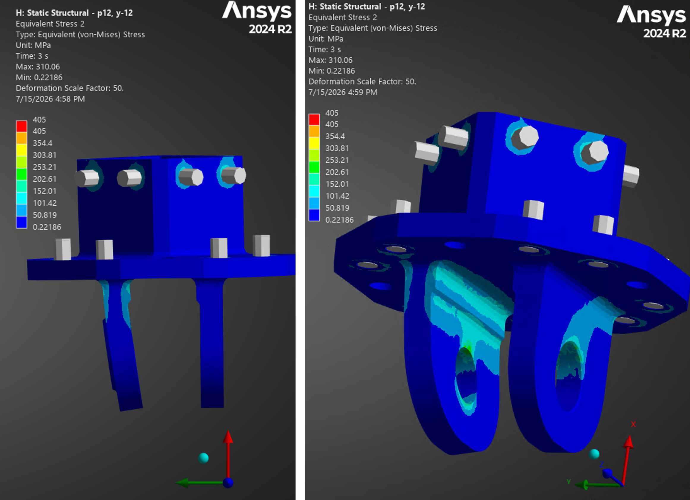{width=70%}  

The Clevis Lug Head in the figure below exhibits a gimbal-angle independent stress distribution. However, the absolute von Mises stress level may increase as exemplarily shown below. The stress peaks location remains. 

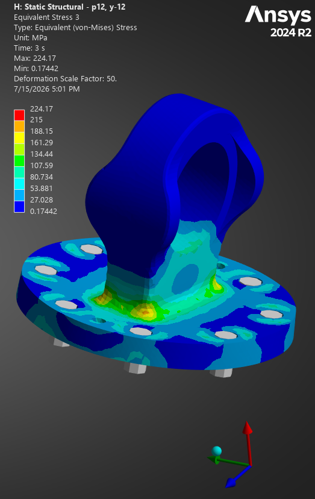{width=45%}  

Figure 17 shows the von Mises stresses in the Bushing and Spacer, which are highest for this gimbal configuration. Their pressure-ellipse locations vary only slightly with pitch and yaw.  

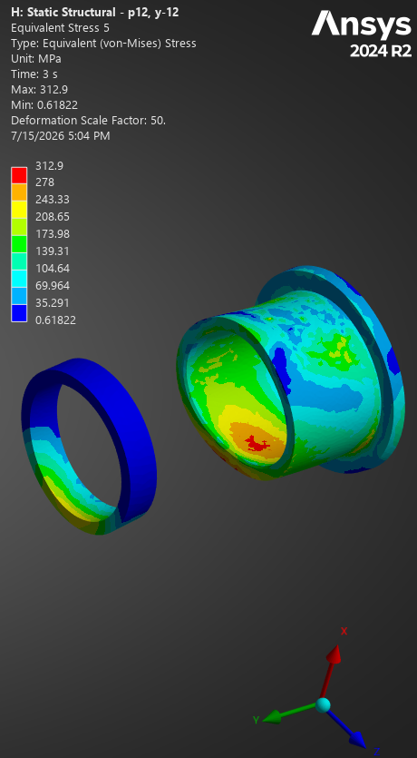{width=45%}  

Overall, FE-Model 4 (Figure 6) shows slightly higher stresses than the nominal case presented in Section 4.1. However, all stresses remain more than 50% below the material yield strengths, confirming a conservative static-structural design. 

\clearpage

## 4.3. Flange Fasteners  

### 4.3.1. Results: Force Reaction

This section presents the reaction forces in the fasteners connecting the GMA to the vehicle-side Thrust Frame Beams and the engine-side Thrust Dome. All fasteners are preloaded to 6,850 N before the external load is applied. Figures 18 and 19 show the resulting forces under thrust load.  

{width=100%}  

\clearpage 

{width=100%}  

### 4.3.2. Results: MOS & Torques

Fastener verification follows [RD13], with safety and design factors derived from [RD12]. The following factors are applied:  

- $SF_\text{yield}$: 1.2 × 1.2 × 1.25 = 1.8
- $SF_\text{ultimate}$: 1.2 × 1.2 × 1.55 = 2.2
- $SF_\text{separation}$: 1.2 × 1.2 × 1.4 = 2.0
- $SF_\text{sliding}$: 1.2 × 1.2 × 1.4 = 2.0

The margins of safety (MOS) are calculated using TEC’s internal tool *BOLTEC*, which implements the methods and equations of [RD13].  

\clearpage  

**MOS**  
Figures 18 and 19 show that the fastener reaction forces vary only slightly across the investigated gimbal orientations (Figure 6). For a conservative verification, the maximum tensile force and corresponding shear force are evaluated.

The most unloaded fastener loses less than 5% of its initial M6 preload. As this reduction is minor, compressive load cases are not assessed separately.

Based on the numbering in Figures 18 and 19, the most highly loaded fastener is verified below:  

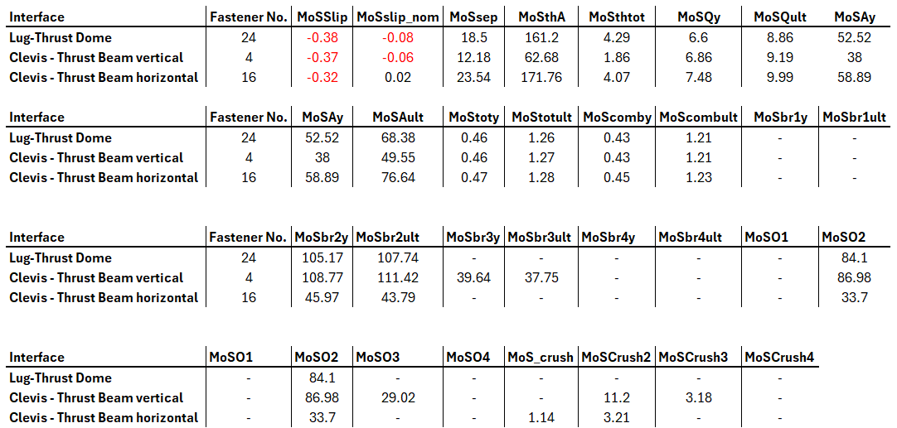{width=90%}  

The maximum extracted shear force is 717 N (Fastener #17, Figure 18), occurring, for example, at pitch/yaw = 12°/0°. This results in a negative sliding MOS. However, the FE model does not include the dowel pins, which are intended to carry shear loads before the threaded fasteners are significantly loaded. Hence, the negative MOS values are not considered critical. All other MOS values are positive and acceptable for the static-structural assessment.   

**Torques** 

As the fastener loads and interface friction assumptions are comparable, a uniform tightening torque of 7.2 Nm shall be applied to all M6 fasteners.  

\clearpage

## 4.4. NAS-bolt preload

The Castellated Nut shall be tightened until the axial joint stack is fully seated and unacceptable axial play is eliminated. It shall then be advanced only in the tightening direction to the first position at which a castellated slot aligns with the bolt cross-hole, after which the Cotter Pin shall be installed.

For the specified 0.6250-18 UNJF-3A thread, the pitch is

$$
p=\frac{1}{18},\text{in}=1.41,\text{mm}.
$$

The MS9358-016 Castellated Nut has six equally spaced slots, corresponding to an angular spacing of 60°. The maximum additional axial thread advance required for alignment is therefore

$$
\Delta s=\frac{60^\circ}{360^\circ}\cdot1.41,\text{mm}
=0.235,\text{mm}.
$$

This value represents a conservative maximum nut advance after seating. It shall not be interpreted as direct bolt elongation, since the displacement is distributed among bolt extension, joint-stack compression, thread deformation, contact settlement, and other compliance effects.

For demonstration purposes, applying an axial advance of 0.235 mm in the ANSYS bolt-pretension model results in a calculated preload of 63.4 kN. This idealized result includes the modeled stiffness and contact behavior of the bolt and clamped components but excludes installation scatter, embedment, relaxation, and other assembly effects.

Assuming a friction coefficient of 0.2 at the clamped interfaces, the analysis shows that this preload significantly alters the lateral load path. Under the 22.5 kN thrust load, Figure 21 indicates that a substantial portion of the load is transferred through interface friction rather than through the intended NAS-bolt, bearing inner member, and Clevis Head bore contact path.

Figure 21 shows also the corresponding von Mises stresses. The results are intended for relative comparison only, as the mesh may be insufficient for assessing local peak stresses. Although the overall deformation pattern of the NAS-bolt and adjacent components remains largely unchanged, the Spacer, Bushing, and NAS-bolt exhibit significantly increased stresses. The scaled deformation also indicates additional bending of the Bushing and Spacer due to frictional load transfer.    

{width=70%}  

In summary, a **minimum installation torque of 5 Nm** is specified to ensure seating of the joint stack and elimination of unacceptable axial play. The maximum torque is limited to prevent the operational thrust load from being transferred predominantly through interface friction, as illustrated above. Using NASA’s *Alternative Torque Formula* [RD07] for preliminary torque estimation, a **maximum NAS-bolt torque of 17 Nm** is derived, corresponding to an approximate axial preload of 6 kN.

The final torque range and installation procedure shall be specified in the MAIT Plan [RD10].   

\clearpage 
  
# 5. Bearing Lifetime  

The Spherical Bearing size is defined by the NAS-bolt grip diameter, selected through preliminary hand calculations. For a quasi-static load of 22.5 kN [RD08] and unrestricted bending due to radial clearance, the *NAS6710DU29* bolt is selected. This determines the use of an *MS14103-10 *Spherical Bearing with a bore diameter of 0.625 in.  

As the applicable military standards provide no specific lifetime calculation method, the *SKF* *Basic Rating Life method* [RD14] is used to assess the maintenance-free steel/PTFE-fabric bearing. 

Using the simulated thrust-load and angular-deflection histories, the SKF Basic Rating Life method [RD14] yields a calculated basic rating life of **12,805 operating hours**. This value is a theoretical guideline for estimating the achievable service life and does not represent a guaranteed operating lifetime.  

For steel/PTFE-fabric spherical bearings under constant-direction loading, SKF defines the basic rating-life criteria as an increase in bearing clearance of 0.3 mm or a coefficient of friction of 0.15 [RD06]. Application-specific effects—including contamination, corrosion, temperature, installation conditions and complex kinematic loading—may result in a shorter or longer service life. Representative testing is
therefore required to validate the calculated lifetime under expected engine operating conditions.  

SKF self-lubricating Spherical Bearings are tested according to AS81820, formerly MIL-B-81820 [RD16], under the following conditions:  

- Unidirectional radial load  
- Room temperature  
- Oscillation angle: ±25° (100° total travel per cycle)  
- Duration: 25,000 cycles  
- Speed: 10 cycles per minute  

These conditions provide a reference for evaluating bearing performance but differ from the GMA operating conditions, which e.g. include deflections of up to ±12° under variable, oscillating thrust loads. Bearing lifetime must therefore be verified through representative testing and inspection.  

For the GMA, the project-specific end-of-life criterion is defined as a maximum internal bearing clearance of **0.1 mm**. Based on [RD15], this limit is estimated to correspond to approximately 5,000 cycles under the stated reference conditions. Thrust-load testing shall determine whether this estimate adequately represents the wear and lifetime of the bearing under actual operating conditions.  

\clearpage  

# 6. Annex  

## 6.1. Tolerance Stack Analyis  

{width=80%}  

{width=80%}  

{width=90%}  

{width=90%} 

\clearpage  

## 6.2. Boundary Conditions Thermal Analysis  

{width=45%}  

{width=70%}  

{width=50%}

{width=35%}  

\clearpage  

## 6.3. Boundary Conditions Static-Structural FEA  

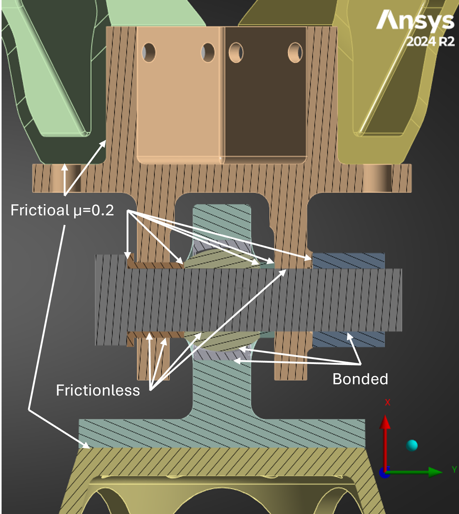{width=70%}   

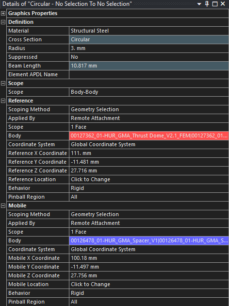{width=40%}  

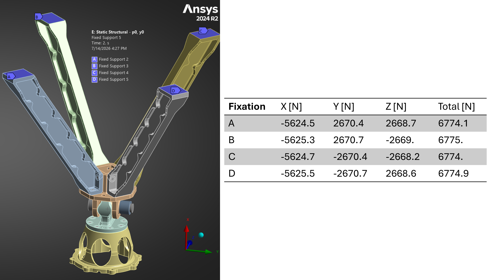{width=90%}    

{width=90%}    

{width=35%}  

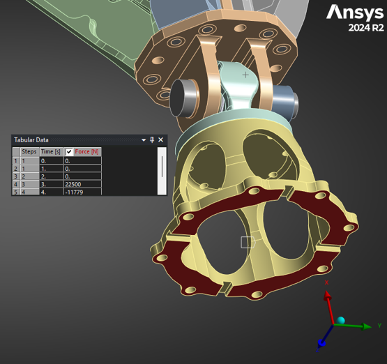{width=70%}  

{width=50%}   

{width=45%}    

{width=40%}  

\clearpage  

## 6.4. GNC data for Basic Rating Life of Spherical Bearing  

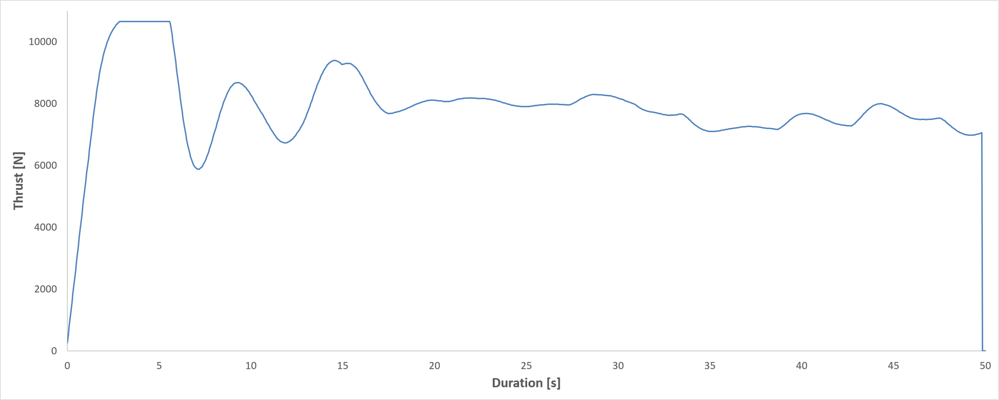{width=80%}  

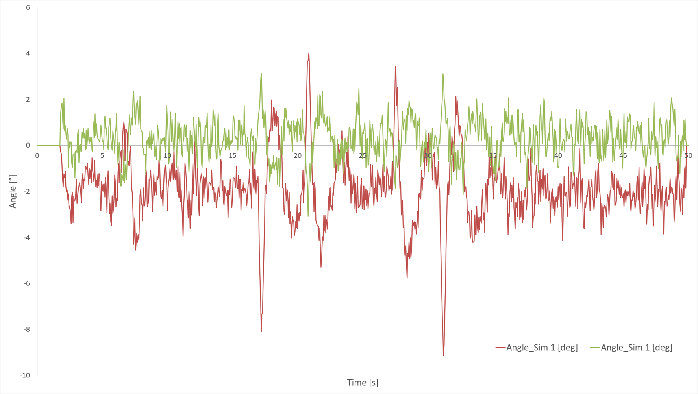{width=80%}  

\clearpage  

## 6.5. Thermo-mechanical Analysis  

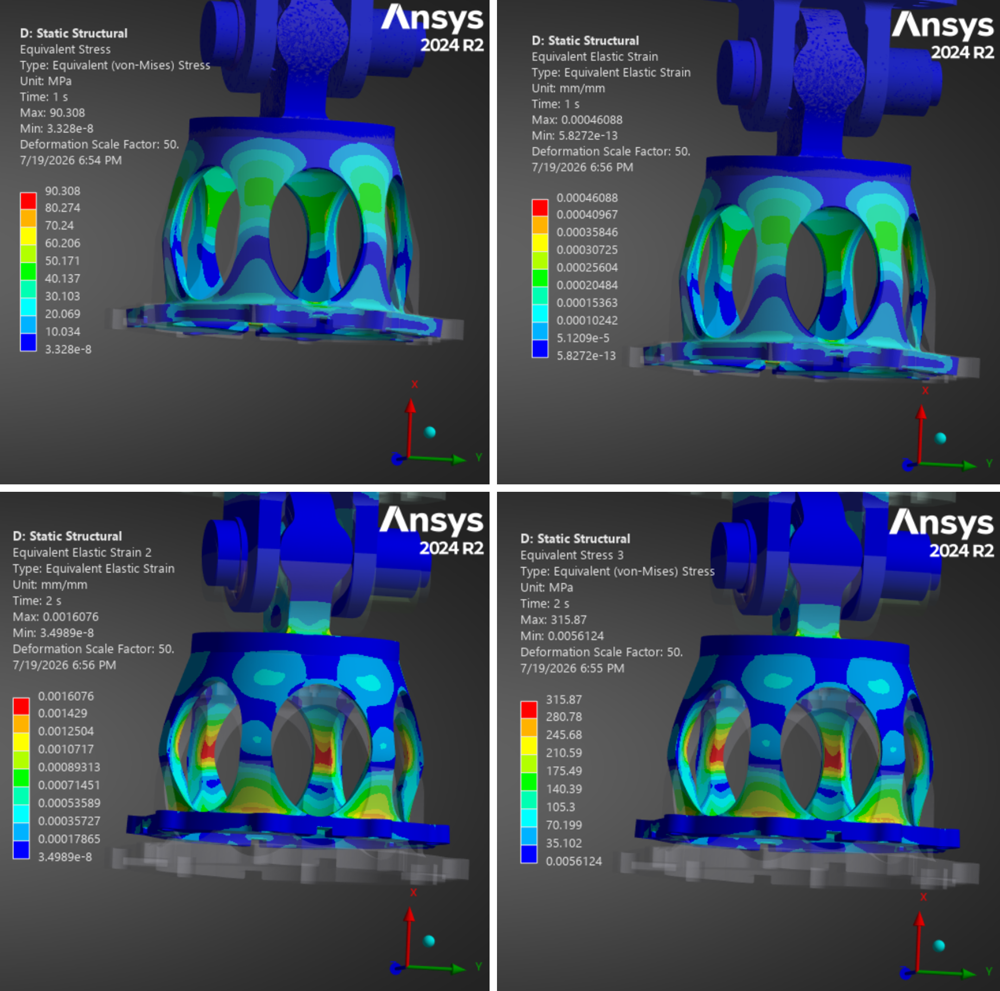{width=100%}

\clearpage  

## 6.6. Static-Structural: GMA - pitch 0°, yaw 0° - Acceleration Load  

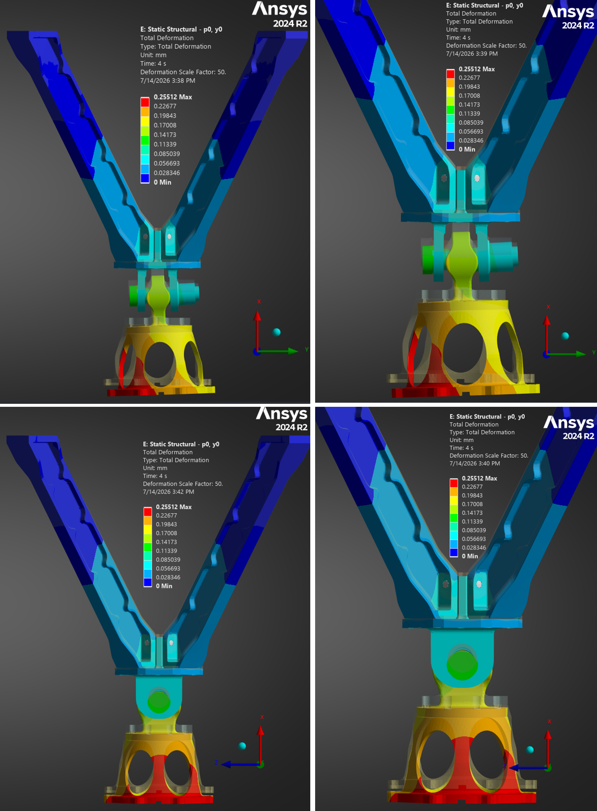{width=80%}  

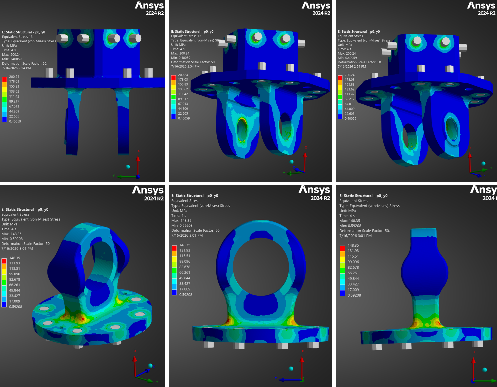{width=80%}  

  

{width=80%}  

\clearpage  

## 6.7. Static-Structural: Thrust Dome / Beams - Thrust Load  

{width=100%}  

{width=100%}  

\clearpage  

## 6.8. Static-Structural: Thrust Dome / Beams - Acceleration Load  

{width=60%}  

{width=60%}   

\clearpage  

# 7. Acronym List  
The acronyms used in this document are listed below.  

| **Acronym**  | **Definition**   |
|---|---|
|COTS|Commercial Off-The-Shelf|
|GNC|Guidance Navigation Control|
|GMA|Gimbal Mount Assembly|
|IH|Injection Head|
|MAIT|Manufacturing, Assembly, Integration and Test|
|MOS|Margin Of Safety|
