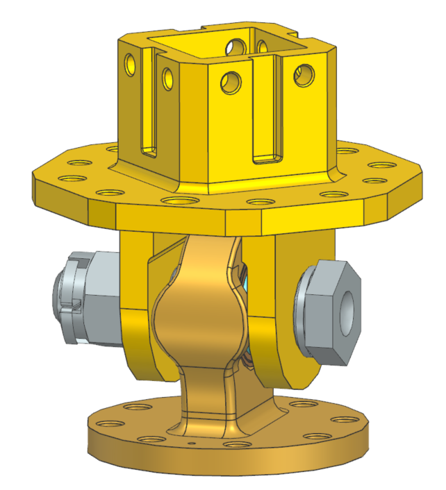
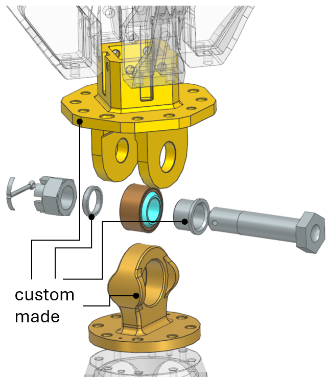
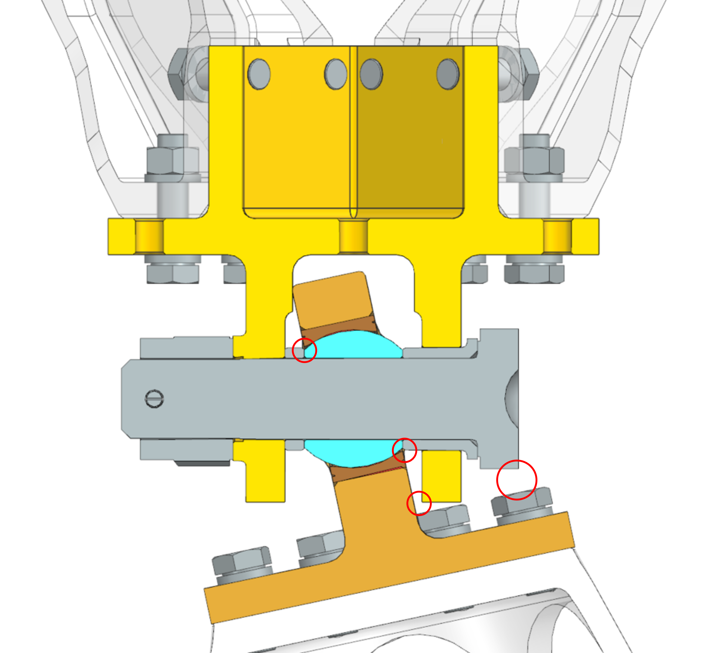
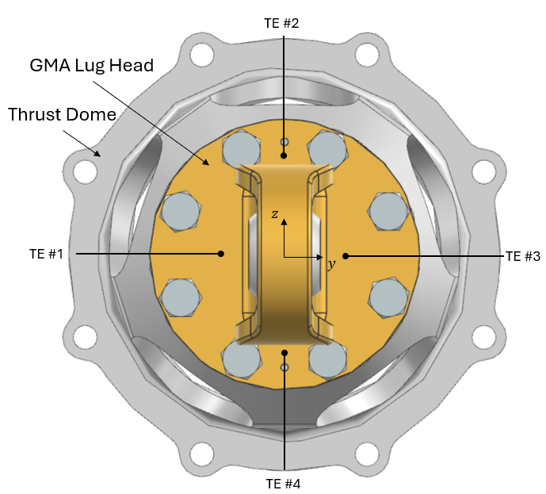
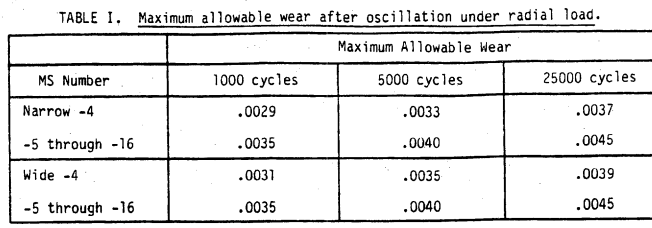

\pagenumbering{roman}
\setcounter{page}{1}
\clearpage
\pagenumbering{arabic}

# 1. Introduction
## 1.1. Scope  
The purpose of the Manufacturing, Assembly, Integration and Test (MAIT) Plan is to describe the
 MAIT process and demonstrate together with the verification plan how the requirements are verified by
inspection and test.
It contains the overall Manufacturing, AIT activities, suggestions for associated verification tools (GSE - Ground Support Equipment) and the involved documentation.

## 1.2. Reference  

[RD1] Gimbal Mount Assembly - Definition File / Version 001  

[RD2] Gimbal Mount Assembly - Interface Control Document / Version 001  

[RD3] Data Sheet - ARMCO 17-4PH / 2022  

[RD4] Instructions for Double Anvil Spherical Bearing Swaging Tool #10 Wide / Pegasus Auto Racing Supplies, Inc.  

[RD5] Bearing Installation and Retention by Swaging or Staking / AIA - NAS0331 / 2013  

[RD6] NASA Reference Publication 1228 - Fastener Design Manual / Richard T.Barrett / 1990  

[RD7] Nyx Moon - Huracan Development Logic / TEC-FRA-DOC-2024-01004 / Issue 02  

[RD8] Gimbal Mount Assembly - Justification File/ Version 001  

[RD9] Structural Design and Test Factors of Safety For Spaceflight Hardware / NASA-STD-5001B / Change 3 /

[RD10] Gimbal Mount Assembly - Preliminary Verification Control Document / Version 001  

[RD11] Nyx Moon - Huracan Overall Test Plan / TEC-FRA-DOC-2024-01005/ Issue 01  

[RD12] Bearings, Plain, Self-Aligning, Self-Lubricating, Low Speed Oscillation, General Specification / MIL-B-81820E / 1986

\clearpage

# 2. GMA Presentation  

The Gimbal Mount Assembly (GMA) is the primary thrust-transmitting interface between the engine and vehicle. It transfers engine thrust to the vehicle structure and permits engine gimbaling for thrust-vector control. The design is defined in the Definition File [RD1] and Interface Control Document [RD2].  

{width=30%}

# 3. Manufacturing  

Manufacturing shall follow the company's approved processes from material procurement through final machining and quality control. Figure 2 shows the custom-machined parts. All other parts are Commercial Off-The-Shelf (COTS) items, as defined in [RD1].  

{width=50%}

## 3.1. Materials and Heat Treatment

All custom machined parts of the GMA (Figure 2) are made of martensitic precipitation hardened stainless steel, that combines high strength, excellent corrosion resistance, easy heat treatment and comparable thermal expansion w.r.t Inconel 718 (engine). As one of the main structural parts of the engine, the GMA is treated as a critical application. For this, the material shall be sourced in a precipitation hardned condition. The final material choice is **17-4PH - H900**, while the suffix expresses the heat treatment condition. The figure below shows a general overview of material properties as a function of the precipitation hardened conditions ranging from *H900* to *H1150M*.

{width=80%}  
 

## 3.2. Machining 

The GMA Lug Head and Clevis Head are recommended to be manufactured using a 5-axis CNC machine to achieve the required precision and produce the complex geometries specified in the manufacturing drawings.  

The Spacer and Bushing shown in Figure 2 may be manufactured by precision turning, as these components determine the radial clearance and the axial positioning accuracy of the adjacent parts.

The final manufacturing strategy shall be determined by the manufacturer, provided that all requirements specified in the manufacturing drawings are met.

# 4. Assembly  

This chapter describes the required tools and procedures to assemble the GMA. 

## 4.1. Required Tools  

The tools required mount the GMA are listed below:

- Hydraulic press to position the Spherical Bearing *MS14103-10* with the GMA Lug Head with a calibrated load of 21,375 lbs +/- 3,000 (95 kN +/-13 kN) [RD4]
- Double Anvil Spherical bearing Swaging Tool for Spherical Bearing *MS14103-10* according to [RD5]
- Troque Wrench for Bolt NAS6710D29 and Nut MS9358-016
- Torque Wrench for ISO4017-M6x16/25-A4-70 hexagon head screws and ISO4032-M6-A4-70 hexagon regular nuts
- Pliers to bend the Cotter Pin in place

## 4.2. Assembly Sequence  

The sequence of the assembly is described in this chapter. The subsequent description shall be accompanied during practical execution along side dedicated 3D data (CAD-ID: 126703/01). 

The assembly is divided in two main steps (Figure 4).  

{width=80%}  

In the **first step** (Figure 4, left), the Spherical Bearing *MS14103-10* is installed into the Clevis Lug Head. Due to the interference fit between the outer race of the Spherical Bearing and the Lug Head bore ranging from *-0.0055 mm to +0.0202 mm*, a mounting force will be required. The bearing shall be pressed centrally into the housing using the custom anvil, CAD-ID: 2020/01. The tool shall contact the bearing outer ring only. No insertion load shall pass through the inner ring or PTFE liner. The tool shall position the bearing at the specified axial location. The bearing shall then be swaged in accordance with Method 100 of [RD5] and the instructions in [RD4]. The final swage geometry and bearing breakaway torque shall be inspected and recorded.  

In the **second step** (Figure 4, right), the swaged Lug Head subassembly is installed in the GMA Clevis Head. The remaining components use clearance fits and shall be assembled at ambient temperature.  

Following the numbering in Figure 4, position the Spacer (2) and Lug Head subassembly (3) coaxially within the Clevis Head (8). The Clevis Head ears are asymmetric. Install the Spacer (2) on the inner side, between the smaller Clevis bore and the bearing inner ring.  

Insert the Bushing (4) through the larger Clevis bore from the opposite side. Push it inward until it contacts the bearing inner race.

When the Spacer, Lug Head subassembly, and Bushing are aligned, insert the NAS-bolt (5) from the Bushing side. Install the Castellated Nut MS9358-016 (6) on the opposite side.  

The NAS-bolt (5) is then tighted by hand with the Castellated Nut (6) on the opposite, outer side of the GMA Clevis Head (8). After a hand-tight preload between the Bolt and Nut, the Nut´s preload is then increased until the next slot of the nut aligns with the drilled hole of the bolt. This final applied torque is to be recorded.   

After appliction of the torque, both parts shall be secured from loosening with the Cotter Pin (7). In accordane to NASA recommendations [RD6], the Cotter Pin shall be bended as illustrated in Figure 5.  

![Bending of Cotter Pin [RD6]](<../WP3/figures/GMA_NASA_thread locking.png>){width=40%}  

# 5. Integration  

After the GMA is assembled, the GMA is integrated with the engine-side and vehicle-side structures.  

The GMA is not attached directly to the engine or vehicle. It interfaces with the engine through the Thrust Dome and with the vehicle through four Thrust Frame Beams [RD1], [RD2].  

**GMA-Engine**  
Eight hexagon-head screws and two Ø4 m6 dowel pins connect the GMA Lug Head to the Thrust Dome, as shown in Figure 6. The dowel fit is tighter on the Thrust Dome side. Therefore, the dowel pins are installed in the Thrust Dome flange first.

Align the GMA Lug Head with the dowel pins and seat the interface without forcing it. All eight M6 fasteners are torqued hand-tight. Application of preload in a cross-pattern to 30 %, 60 %, and 100 % of the specified final torque listed in the Table 1 is then recommended.  

{width=55%}  

**GMA-Vehicle**  
Sixteen fasteners, including bolts, washers, and nuts, connect the GMA Clevis Head to the four Thrust Frame Beams [RD2]. Figure 7 shows their configuration and orientation.  

{width=55%}  

Before tightening, position all beams against the four centring features defined in [RD2]. Full seating and correct beam orientation is to be confirmed.  

The final tightening sequence shall be defined in the controlled integration procedure. All four beams are progressively tightened rather than completing one beam at a time. After hand-tightening all fasteners, apply 30 %, 60 %, and 100 % of the specified final torque in the sequence shown in Figure 8.  

Figure 8 shows the view toward the Thrust Frame Beams in the yz-plane, with the GMA Clevis Head hidden. The thrust vector F_thrust points into the image plane. The blue fasteners are parallel to F_thrust, while the red fasteners lie in the yz-plane.  

{width=100%}  

| **Interface**| **Thread type** | **Designation** |**Preload (Nm)** | 
| ------ | ----- | ----- | ----- | 
| GMA Lug Head - Thrust Dome          |Through-Thread  | ISO4017-M6x16-A4-70  | TBC |
| GMA Clevis Head - Thrust Frame Beam |Through-Thread  | ISO4017-M6x16-A4-70  | TBC |
| GMA Clevis Head - Thrust Frame Beam |Bolt-Nut        | ISO4017-M6x25-A4-70  | TBC |
: Preload of fasteners for integration  

# 6. Test 

The GMA shall undergo a verification programme appropriate to its development status and intended use. Tests are grouped into three categories:  
  
- **Acceptance Tests**
- **Development Tests**
- **Qualification Tests**

The following sections define the objectives, scope, methods, and success criteria for each category.  

## 6.1. Testing Strategy  

**1. Preliminary Development Phase**: Acceptance tests on GMA-part and compoenent level and early testing for risk reduction shall take place during the dedicated TVC test campaign *H05*. 

**2. Development Phase**: Detailed design phase using an iterative approach alongside testing of the Development Models. A total of four Development Models are tested as part of test campaigns: DM1 to DM4 [RD7]. The DM1 campaign used a rigid Thrust Structure without the GMA. The earliest planned GMA entry is therefore DM2, subject to completion of the preceding risk-reduction activities.
   
**3. Qualification Phase**: Testing begins at the Final Design Key Point and continues up to the Ready for Flight
review to ensure the Huracan engine’s readiness for its first mission

## 6.2. Acceptance Test  

Acceptance Tests are performed on each manufactured part to verify conformity, workmanship, structural integrity, and basic functionality before assembly to a component and higher-level engine system testing later. After GMA component acceptance tests, the hardware proceeds to a subsystem testing in the *H05* campaign, which also encompasses the TVC-actuators and the bellows with representative routed and pressurized ducts. *H05* is understood as part of acceptance that is required for early derisking and entry of engine-level testing in the frame of Development Tests. 

### 6.2.1. Inspection  

Each GMA part will be inspected prior entering the acceptance tests. It consists of a visual inspection using
a microscope if required, as well as the measurement of main physical properties such as mass and key
dimensions. Material certificate and heat treatment records are to be reviewed. Geometric dimensioning and tolerancing against the manufacturing drawings are to be verified.  

COTS parts are to be inspected against their procurement specificaitons and certificates. Part numbers, serial or lot numbers are to be recorded where applicable.  

After swaging, the bearing installation is to be inspected in accordance with [RD4] and Method 100 of [RD5]. Swage dimensions, bearing position, surface condition, and breakaway torque are to be recorded.  

| **Sucess criteria**| **Comment** | 
| ------ | ----- | 
| Surface |No cracks, dents, burrs, corrosion, unacceptable scratches, or surface-finish deviations|
| Cleanliness |No chips, debris, dirt, or unapproved residue|
| Material anomalies |Certificates and records conform to the drawing and purchase order|
| Dimensions and Tolerances | All inspected characteristics comply with the manufacturing drawings|
| Breakaway torque |Within the applicable MS14103-10 requirement before installation |
| Swaged installation |Complies with the approved process and gauging criteria in [RD4] and [RD5] |
: Sucess criteria for Inspection  

### 6.2.2. Proof Tests  

Per NASA definition [RD9] a Proof Test shall screen defects in workmannship, material quality to verify structural
integrity. Given the timeline related constraints of the project and the lacking availibility of internal testing
resources, the GMA shall not be proof tested through application of a representative load (e.g. quasi-static load).
Considering the conservative load assumptions during the theoretical analysis in [RD8], the load capabilities of
the military-rated COTS parts (Bolt, Nut, Bearing) and the chosen material, no testing shall be executed to
verify load-related verification requirements listed in [RD10]. Here, the verification by analysis only shall be
sufficient to proceed to further testing. Additionally, any simplified load application other then the one tested on
a Development Model (engine level), will not be representative to give evidence for a successfull Acceptance Test.
This is mainly driven by the nonlinear behaviour of the bearings PTFE-fabric liner and its load-dependend
change of friction coefficient.  

Unlike described in [RD5], the Spherical Bearing MS14103-10 shall not be proof tested for push out of the bearing. Instead, after the staking process, the bearing groove shall be gauged as stated in [RD4] or respectively shown in chatper 7.1. A push out test is not desired as long as the staking process is consistently followed in alignment to the recommendations in [RD4].  

### 6.2.3. Functional Tests  

**Gimbal angle**  
The gimbal angle of the GMA Lug Head about the z-axis (yaw) is limited by Mechanical Stops to a nominal value of ±12 ° [RD1]. The gimbal angle about the y-axis is limited by the available stroke of the TVC actuators.  

The maximum gimbal angle about the z-axis is particularly important because the Mechanical Stops prevent the spherical bearing from exceeding its maximum permissible oscillation angle of ±12 °.  

The maximum gimbal angle can be verified using a magnetic digital angle gauge with a resolution of up to 0.1°. For the measurement, the fixed GMA Clevis Head shall be securely positioned, and the GMA Lug Head shall be vertically aligned in its neutral position, corresponding to an angle of 0°.  

The Lug Head shall then be displaced relative to the fixed Clevis Head in a controlled and precise manner until the Mechanical Stop is reached in both directions, +12 ° and -12 °. Measurement accuracy and repeatability can be improved by minimizing any unintended roll motion during displacement.  
  
**Roll Error**  
The GMA limits vehicle roll about the x-axis through the Anti-Roll Features of the Lug Head and the corresponding inner surfaces of the Clevis Head.  

The clearance shall be measured at all four contact locations. The smallest measured clearance defines the roll angle at which first contact occurs.  

With the Lug Head centred in the Clevis Head, the nominal clearance is 0.3 mm at each location. Based on the defined geometry, this corresponds to a maximum roll error of less than 0.8° (CAD value).

{width=50%}  

**Geometrical Collision**  
During oscillation of the GMA Lug Head, a visual inspection shall confirm that contact between the GMA Lug Head and the GMA Clevis Head occurs only at the intended contact locations.  

As the GMA Lug Head is displaced toward the maximum roll angle, contact shall occur between the Anti-Roll Features of the GMA Lug Head and the corresponding inner surfaces of the GMA Clevis Head.  

Like specified in [RD1], when the maximum yaw angle is reached, the designated Mechanical Stops within the GMA Clevis Head shall be the first features to make contact. Any prior contact between the GMA Clevis Head and the bolt, or between the GMA Clevis Head and any other component or surface with limited clearance, is not permissible.  

Examples of potential contact or interference areas that require particular attention are shown in Figure 10.  

{width=48%}  

**Breakaway Torque**  
The breakaway torque of the Spherical Bearing *MS14103-10* is the torque required to initiate relative angular movement between the inner and outer races when the inner race is held stationary and no external load is applied. This functional test shall support to capture the friction coefficient as referenc for comparison later under operating conditions during Development Tests (see also REQ-018 in [RD10]) 

Verification of the breakaway torque is important for demonstrating TVC functionality and shall be completed as part of the acceptance testing no later than the completion of *H05*.  

Two separate measurements shall be performed to evaluate any change in bearing friction:

- *Bearing-only condition*:  
  The breakaway torque of the uninstalled bearing shall be measured in accordance with the applicable requirements of MS14103.

- *Installed and swaged condition*:  
The breakaway torque shall be measured after the bearing is installed and swaged into the GMA Lug Head. This measurement shall account for any influence of the installation process and the interference fit on bearing friction.

| **Functional feature**| **Sucess criteria** | **Comment** | 
| ------ | ----- |----- |
| Roll Error |max. 0.3 mm| Equals angle error of 0.8 °|
| Gimbal angle |max. 12 °| Overshooting reduces bearing lifetime|
| Geometrical Collision |Controlled contact| Contact with intended surfaces first|
| Break Away Torque bearing only |max. 8 IN-LB | Equals 0.9 Nm|
| Break Away Torque bearing swaged |< 8 IN-LB | Bearing friction decreases with higher surface pressure|
: Sucess criteria for functional GMA tests 

## 6.3. Development Test  

Development tests are conducted during the design-maturation phase to build confidence in new designs and concepts and to support the objectives of the Overall Test Plan at engine-system level in accordance with [RD11].   

Where necessary to identify credible weaknesses or design deficiencies, development-test conditions may extend beyond the normal design or operating range. Development testing is iterative and may be performed concurrently with design modifications. However, successful completion of development testing does not, by itself, constitute qualification unless the test article, configuration, test levels, durations, instrumentation, procedures, and success criteria satisfy all applicable qualification requirements.  

The current GMA represents the first design iteration within the project. During its development, it became evident that parallel developments of adjacent components have a direct and significant impact on the GMA design and on its representativeness with respect to future development and qualification models.  

For example, as described in the Justification File [RD7], the current GMA is not designed to withstand significant thermal loads. This is a consequence of the current Thrust Dome design, which depends on the future design of the Ignition System (IGS), as well as the mission duration of the on-Earth demonstrator *Oneiros*, which is less than 60 s. If the IGS design is modified to achieve the desired reductions in size and mass, and if the mission duration approaches that of the lunar mission, approximately 400 s, thermal loads are expected to become a significant driver of GMA functionality and design.

Provided that the GMA design concept is successfully demonstrated during DM2 and the on-Earth demonstration, these parameters are expected to define the principal design challenges and test objectives for subsequent development-test campaigns.

### 6.3.1. Development Test Objectives  

The Overall Test Plan [RD11] will be updated because TVC is not included in the current version issued at the Preliminary Design Review. Consequently, system-level objectives related to TVC have not yet been defined. Nevertheless, preliminary component-level objectives can be derived from the current development status of the GMA and from the requirements specified in [RD10].

The Overall Test Plan [RD11] will be updated as TVC is not part of the current version from the Preliminary Design Review. Hence, the objectives w.r.t. to the TVC are not yet defined on a system level. Some objectives, however, can be derived based on the current developoment state of the GMA from a component level and the requirements stated in [RD10].  

It should be noted that an individual objective does not necessarily correspond to a single test. Multiple objectives may be addressed during one test run, while a single objective may require several test runs before it can be considered fully achieved.  

**MAIT**  
The MAIT-related objectives are primarily associated with the swaging of the spherical bearing into the GMA Lug Head bore. During development testing, it shall be demonstrated that TEC can control and perform the swaging process in accordance with [RD5].  

The development testing shall also demonstrate that the swaging process secures the bearing in its intended position and that no additional proof testing is required to qualify the process.

**Transient thermal mapping**  
In relation to requirements REQ-020 and REQ-021 [RD10], the objective is to determine whether thermal loads reach the load-transmitting interfaces that permit relative motion and, if so, when they arrive and what temperature levels are reached.  

Thermocouples (TE) shall be used to measure the transient temperature response at relevant locations in the vicinity of the GMA joint. The results shall support the assessment of whether design modifications are required to account for thermal loading in subsequent tests.  

The top view shown in Figure 11 depicts the GMA Lug Head connected to the Thrust Dome by hexagonal-head bolts. The Thrust Dome is, in turn, attached to the Injection Head (IH).  A minimum of four TE´s is recommended. The TE´s should be distributed around the GMA Lug Head flange, with one sensor positioned on each side, to monitor the temperature distribution within the flange plane.  

{width=45%}  

**Bearing Condition Monitoring and Service-Life Assessment**  
The objective is to monitor the condition of the *MS14103-10* Spherical Bearing throughout the engine test campaign and to determine whether it remains suitable for continued use. Ideally, the initial condition of the bearing shall be recorded before the first test and reassessed after each test sequence. However, the inspection intervals shall be coordinated with the other engine test objectives and the schedule and cost constraints of the test campaign, as additional measurement activities may increase test turnaround time and reduce the time available for testing.   

Bearing wear shall be evaluated by measuring the increase in radial play relative to the initial condition. All measurements shall be performed using the same measurement setup, load direction, measurement load, and temperature conditions. The accumulated operating time, number of actuation cycles, bearing loads, and measured temperatures shall be documented. Figure 12 shows a design suggestions for assessing wear by measuring radial play.   

![MIL-B-81820 measurement of radial play [RD12]](<../WP3/figures/GMA_MILB81820E_wear rad. measurement.png>){width=40%}  

The maximum permissible increase in radial play relative to the initial measured condition shall be 0.1 mm. If this limit is exceeded, the bearing shall be replaced before further testing. The bearing shall also be replaced if an inspection identifies liner damage, metal-to-metal contact, seizure, abnormal friction, excessive breakaway torque, or any other condition that could impair GMA functionality.  

The measured progression of bearing wear shall support the definition of appropriate inspection intervals and the assessment of the bearing’s suitability for subsequent testing. Together with the documented operating time, actuation cycles, loads, and temperatures, the results may also support an initial assessment of bearing service life under the tested operating conditions.  

**Wear of parts measurement and inspection**  
In accordance with the assembly procedure described in Section 4.2, the NAS-bolt shall not be tightened to its maximum allowable preload. The applied preload is intended primarily to secure the axial stack between the bolt head and the nut while maintaining the required alignment and position of the connected components.  

Relative motion is intended to occur only between the inner and outer races of the spherical bearing. However, because the applied bolt preload is relatively low compared with the load-carrying capacity of the A286 bolt, unintended relative motion may occur between the NAS-bolt and adjacent components, including the Spacer, Bushing, and GMA Clevis Head. Potential contact surfaces are indicated in Figure 13.  

{width=40%}   

To detect rotation, displacement, or loosening within the bolted joint, witness marks shall be applied across the bolt, nut, and adjacent components. The witness marks shall be visually inspected after each defined test sequence for any discontinuity or misalignment.    

During the bearing-wear inspections described above, the grip section of the NAS bolt, the bores of the GMA Lug Head, the spacer, and the bushing shall also be inspected for scratches, fretting, deformation, material transfer, and other signs of wear. Where accessible, the dimensions of all contact surfaces at which unintended relative motion may occur due to insufficient clamping force shall be measured and compared with the dimensional inspection results recorded before assembly of the GMA.  

| **Objective**| **Sucess criteria** | **Comment** | 
| ------ | ----- |----- |
| Thermal mapping |delta_T~10 °C| delta_T=T_ambient - T_sensor|
| Wear of Spherical Bearing |max. delta_s=0.1 mm|value before and after testing |
| Wear of Bolt, Spacer, Bushing, GMA Lug Head bores |no wear|wear not permissible|
: Sucess criteria for GMA development tests  

The approximate temperature difference of delta_T~10 °C is intended as an indicator during extended hot-fire testing that the GMA Lug Head bore is approaching temperatures at which thermally induced mechanical effects may become significant. This value may also be used to define a test redline, allowing the test to be stopped before thermal contraction causes complete blockage or seizure of the GMA.  
  
## 6.4. Qualification Test  

Qualification testing is performed after the design has reached a controlled and sufficiently mature configuration. It is conducted using a dedicated qualification engine or another approved flight-representative engine to demonstrate that the design complies with all specified requirements under the intended operational environments, including the applicable qualification margins.  

The qualification-test objectives are assumed to be defined and executed at engine-system level. Accordingly, the applicable qualification objectives, test conditions, procedures, and success criteria are specified in the Huracan Overall Test Plan [RD2].  

\clearpage  

# 7. Annex  
## 7.1. Instructions: Spherical Bearing Swaging Tool

![User instructions for swaging [RD4]](<../WP3/figures/Pegasus_instructions bearing swaging.png>){width=70%}  

\clearpage    

![Anvil swaging [RD4]](<../WP3/figures/Pegasus_instructions bearing swaging_Fig4.png>){width=60%}  
  

![Gauging of swaged bearing [RD4]](<../WP3/figures/Pegasus_instructions bearing swaging_Fig5.png>){width=60%}  

\clearpage   

## 7.2. Extracts from MIL-B-81820E  

{width=70%}    

![MIL-B-81820 oscillating under load [RD12]](<../WP3/figures/GMA_MILB81820E_oscillating test.png>){width=80%}    

\clearpage    

# 8. Acronym  

| **Acronym**  | **Definition**   |
|---|---|
|COTS |Commercial Off-The-Shelf|
|GMA  |Gimbal Mount Assembly|
|GSE  |Ground Support Equipment|  
|IH   |Injection Head |
|IGS  |Ignition System|
|MAIT |Manufacturing, Assembly, Integration and Test|
|TE   |Thermocouple|
|TVC  |Thrust Vector Control|
: Acronyms

